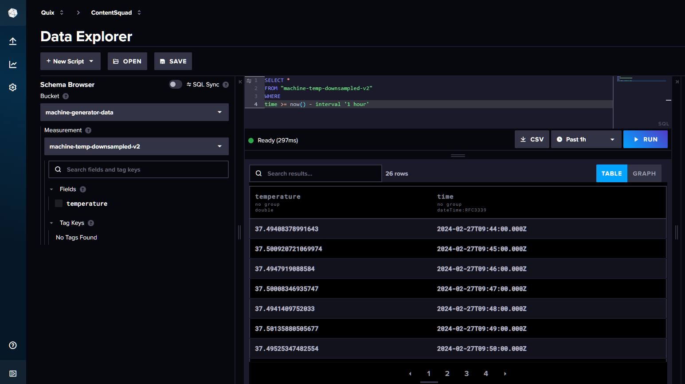

# Add an InfluxDB destination connector

You learned how to do this in the [InfluxDB Quickstart](../../integrations/databases/influxdb/quickstart.md). 

Make sure the input topic to the destination is the same as output of the source connector, `influxdb-v2-data`.

[Configure the connector with your InfluxDB v3 credentials](influxdb-source.md#set-the-environment-variables), which you learned how to do in the previous part.

In addition you need to set the following variables:

| Environment Variable | Description|
|---|---|
| `INFLUXDB_FIELD_KEYS` | These are the columns of rows of data that you want to write to the InfluxDB v3 database. |
| `INFLUXDB_TAG_KEYS` | The metadata that you want to write to the InfluxDB v3 database. |

To see more documentation on these variables, and examples, you can refer to the [detailed README](https://github.com/quixio/template-influxv2-to-v3?tab=readme-ov-file#influxdb-v3-sink){target=_blank}.

??? "InfluxDB terminology"

    | InfluxDB | General database |
    |---|---|
    | Bucket | Database |
    | Measurement | Table |
    | Point | Row |
    | Field | Column |
    | Tag | Metadata |

When you've completed the configuration for the connector, deploy it.

Your pipeline now looks like this:

## Query your InfluxDB data

You can now log into your InfluxDB Cloud account, and query your bucket for data, to make sure data is being written to the InfluxDB v3 database correctly. For example:

!!! note

    The actual bucket names and the specific query will depend on the specific data you are migrating.

## 🏃‍♀️ Next step

[Part 5 - Summary and next steps :material-arrow-right-circle:{ align=right }](./summary.md)
