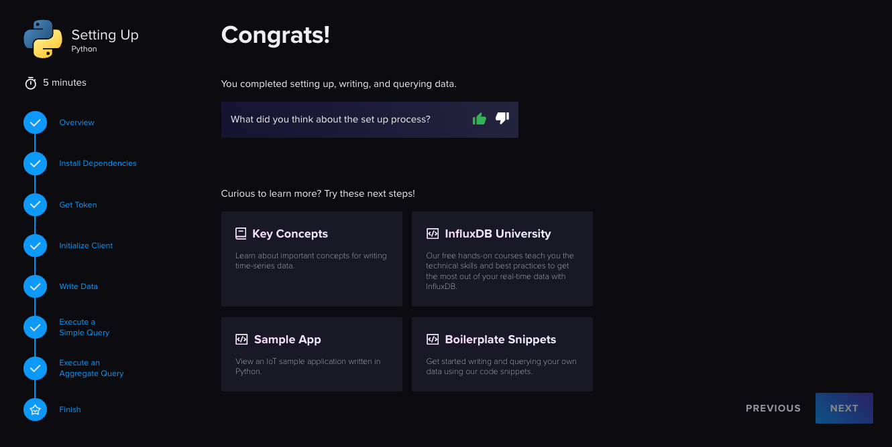
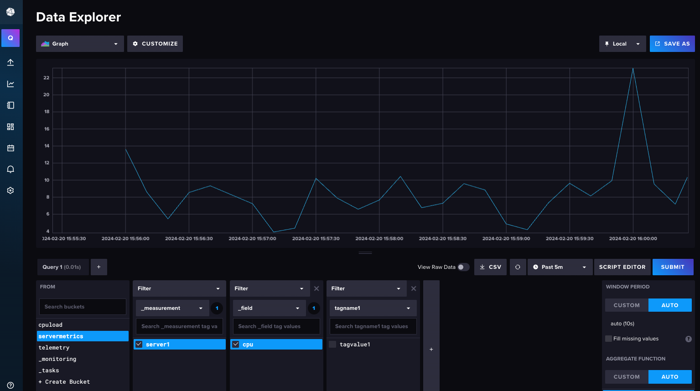

# Install InfluxDB v2

In this step you install InfluxDB v2 locally and write some test data to a bucket.

!!! important

    If you already have an InfluxDB install containing data, then this step is not required.

You can download InfluxDB v2 from the [downloads page](https://www.influxdata.com/downloads/).

You can follow the Influx [install instructions](https://docs.influxdata.com/influxdb/v2/install/) for your platform.

Once InfluxDB is running you can complete the installation by navigating to http://localhost:8086.

You can use any bucket name you like. Make a note of it though, you'll use it later.

The completed getting started guide:



For your reference the code you build in the getting started guide:

``` python
import influxdb_client, os, time
from influxdb_client import InfluxDBClient, Point, WritePrecision
from influxdb_client.client.write_api import SYNCHRONOUS

token = os.environ.get("INFLUXDB_TOKEN")
org = "Quix Docs"
url = "http://localhost:8086"
bucket="telemetry"

write_client = influxdb_client.InfluxDBClient(url=url, token=token, org=org)
write_api = write_client.write_api(write_options=SYNCHRONOUS)
   
for value in range(5):
  point = (
    Point("measurement1")
    .tag("tagname1", "tagvalue1")
    .field("field1", value)
  )
  print("Writing value to InfluxDB v2: --> ", value)
  write_api.write(bucket=bucket, org="Quix Docs", record=point)
  time.sleep(1) # separate points by 1 second
```

Note that in the above code, the bucket was called `telemetry`.

## Write data continuously

You can modify this code to create a client that writes data continually.

Create a new bucket called `servermetrics` and then write and run the following InfluxDB client:

``` python
import influxdb_client, os, time, psutil
from influxdb_client import InfluxDBClient, Point, WritePrecision
from influxdb_client.client.write_api import SYNCHRONOUS

def get_cpu_load():
    cpu_load = psutil.cpu_percent(interval=1)
    return cpu_load

def main():
    token = os.environ.get("INFLUXDB_TOKEN")
    org = "Quix Docs"
    url = "http://localhost:8086"
    bucket="servermetrics"

    write_client = influxdb_client.InfluxDBClient(url=url, token=token, org=org)
    write_api = write_client.write_api(write_options=SYNCHRONOUS)

    while True:
        cpu_load = get_cpu_load()
        print("CPU load: ", cpu_load)
        point = (
            Point("server1")
            .tag("tagname1", "tagvalue1")
            .field("cpu", cpu_load)
        )
        print("Writing value to InfluxDB v2: --> ", cpu_load)
        write_api.write(bucket=bucket, org="Quix Docs", record=point)

if __name__ == '__main__':
    try:
        main()
    except KeyboardInterrupt:
        print('Exiting due to keyboard interrupt')
```

You can query your data in InfluxDB v2:



At this point you have a working InfluxDB v2 installation plus some data to migrate to InfluxDB v3.

## 🏃‍♀️ Next step

[Part 2 - Clone the template project :material-arrow-right-circle:{ align=right }](./get-project.md)
