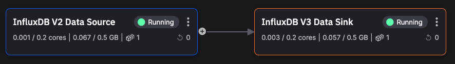

# Migrating InfluxDB v2 to v3 using Quix

In this tutorial you learn how to migrate your data from InfluxDB v2 to InfluxDB v3 using Quix.

!!! important

    This assumes you have an existing InfluxDB v2 with data you want to migrate. However, there is an optional step which shows you how to install InfluxDB v2 locally, and write some test data to it. You can then use this to complete the tutorial.

## Technologies used

* [Quix Cloud](https://quix.io/){target=_blank}
* [Quix Streams](https://github.com/quixio/quix-streams){target=_blank}
* [InfluxDB](https://influxdata.com){target=_blank}

## Getting help

If you need any assistance while following the tutorial, we're here to help in the [Quix Community](https://quix.io/slack-invite){target="_blank"}.

## Prerequisites

To complete this tutorial you'll need to:

* [Obtain a free Quix account](https://portal.platform.quix.io/self-sign-up)
* [InfluxDB v2](https://www.influxdata.com/downloads/){target=_blank} (Cloud or self-hosted)
* [InfluxDB v3 Cloud](https://docs.influxdata.com/influxdb/cloud/sign-up/){target=_blank}

!!! tip

    Completing the [InfluxDB quickstart](../../integrations/databases/influxdb/quickstart.md) before embarking on this tutorial is not essential, but is highly recommended.

## GitHub repository

There is a [GitHub repository](https://github.com/quixio/template-influxv2-to-v3){target=_blank}, containing all the code for this template project.

## The pipeline

Here's the pipeline you build:

## The parts of the tutorial

This tutorial is divided up into several parts, to make it a more manageable learning experience. The parts are summarized here:

1. [Install InfluxDB v2](./influxdb-v2-install.md) - in this **optional** step you install InfluxDB v2 locally. If you already have an InfluxDB v2 installation, you can use that instead. If you'd rather just test things out locally first, the follow this step.

2. [Create the project](./create-project.md) - create a project in Quix Cloud. You learn how to create the complete pipeline in this tutorial, but you can also [fork the project](../../create/fork-project.md) or [clone the project](../../create/clone-project.md).

3. [Add an InfluxDB v2 source](./influxdb-source.md) - assuming you are building the pipeline yourself, you add a Quix InfluxDB source connector to your pipeline. This is used to get data into a Quix topic.

4. [Add an InfluxDB v3 destination](./influxdb-destination.md) - you add a Quix InfluxDB destination connector to your pipeline. This enables you to publish data from Quix to InfluxDB v3. You then query your InfluxDB v3 database to ensure the data has been migrated correctly.

5. [Summary](./summary.md) - conclusion and next steps.

## 🏃‍♀️ Next step

[Part 1 - Install InfluxDB v2 :material-arrow-right-circle:{ align=right }](./influxdb-v2-install.md)
