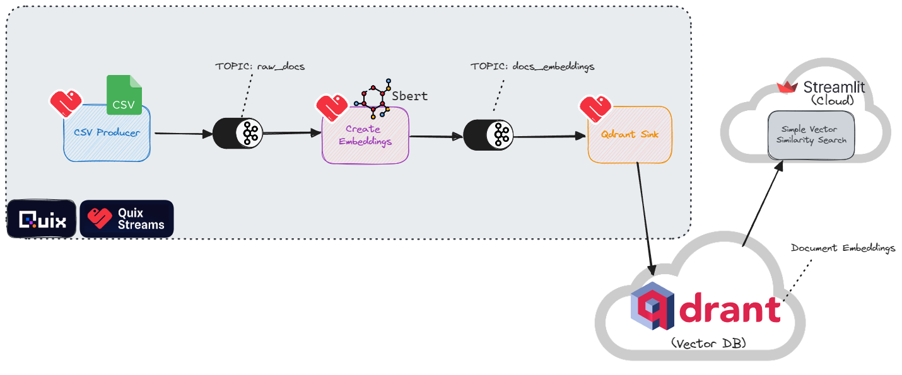

# Continuously ingest documents into a vector store using Apache Kafka

[](https://colab.research.google.com/github/quixio/tutorial-code/blob/main/notebooks/Continuously_ingest_documents_into_a_vector_store_using_Apache_Kafka.ipynb)

Stream data from a CSV (simulating CDC or "Change Data Capture") and ingest it into a vector store: for semantic search.

This demo features the following open source libraries:

* **Quix Streams** to produce data to, and consume data from, Apache Kafka.

* **Qdrant** to create a database to store embeddings and for basic similarity search


## Setup

Install the libraries and Apache Kafka, then start the Kafka servers.

### 1. Install the main dependencies

Dependencies include:the Quix Streams library, Qdrant library, and the sentence transformers library (we'll use the default sentence transformers embedding model).

```{python}

!pip install quixstreams==2.1.2a qdrant-client>=1.1.1 sentence-transformers pandas
```

### 2. Download and setup Kafka and Zookeeper instances

Using the default configurations (provided by Apache Kafka) for spinning up the instances.

```{python}
!curl -sSOL https://dlcdn.apache.org/kafka/3.6.1/kafka_2.13-3.6.1.tgz
!tar -xzf kafka_2.13-3.6.1.tgz
```

```{python}

!./kafka_2.13-3.6.1/bin/zookeeper-server-start.sh -daemon ./kafka_2.13-3.6.1/config/zookeeper.properties
!./kafka_2.13-3.6.1/bin/kafka-server-start.sh -daemon ./kafka_2.13-3.6.1/config/server.properties
!echo "Waiting for 10 secs until kafka and zookeeper services are up and running"
!sleep 10
```

### 3. Check that the Kafka Daemons are running

Show the running daemon processes by filtering the list for the keyword "java" while excluding the grep process itself

```{python}

!ps aux | grep -E '[j]ava'
```

### 4. Import all the libraries and set some constants

Import the required libraries including Quix and Qdrant and set some constants for frequently used variables.

```{python}
import json
import time
import uuid
import os
import pandas as pd
from qdrant_client import models, QdrantClient

# Quix stuff
from quixstreams.kafka import Producer
from quixstreams import Application, State, message_key
from sentence_transformers import SentenceTransformer

docs_topic_name = 'docs_books'
vectors_topic_name = 'vectors_all-minilm-l6-v2'
consumergroup_name = 'qdrant-demo'
collectionname = "book-catalog"
```

## 1. First ingestion pass

* In the first pass, we'll add some initial entries to a "book-catalog" vector store via Kafka, then search the vector store to check that the data was ingested correctly.
* In the second round we'll go through the whole process again (albeit faster) with new data, and see how the matches change for the same search query.

### 1.1 Create data

Create sample data and dump it to CSV (so we can get used to producing to Kafka from a CSV file in the next steps)

```{python}
# Let's create a dataset based on sci-fi books.
documents = [
  { "name": "The Time Machine", "description": "A man travels through time and witnesses the evolution of humanity.", "author": "H.G. Wells", "year": 1895 },
  { "name": "Ender's Game", "description": "A young boy is trained to become a military leader in a war against an alien race.", "author": "Orson Scott Card", "year": 1985 },
  { "name": "Brave New World", "description": "A dystopian society where people are genetically engineered and conditioned to conform to a strict social hierarchy.", "author": "Aldous Huxley", "year": 1932 },
  {"name": "An Absolutely Remarkable Thing", "description": "A young woman becomes famous after discovering a mysterious alien artifact in New York City.", "author": "Hank Green", "year": 2018},
  { "name": "Dune", "description": "A desert planet is the site of political intrigue and power struggles.", "author": "Frank Herbert", "year": 1965 },
  { "name": "Foundation", "description": "A mathematician develops a science to predict the future of humanity and works to save civilization from collapse.", "author": "Isaac Asimov", "year": 1951 },
  { "name": "Snow Crash", "description": "A futuristic world where the internet has evolved into a virtual reality metaverse.", "author": "Neal Stephenson", "year": 1992 },
  { "name": "Neuromancer", "description": "A hacker is hired to pull off a near-impossible hack and gets pulled into a web of intrigue.", "author": "William Gibson", "year": 1984 },
  { "name": "The War of the Worlds", "description": "A Martian invasion of Earth throws humanity into chaos.", "author": "H.G. Wells", "year": 1898 },
  { "name": "The Hunger Games", "description": "A dystopian society where teenagers are forced to fight to the death in a televised spectacle.", "author": "Suzanne Collins", "year": 2008 },
  { "name": "The Andromeda Strain", "description": "A deadly virus from outer space threatens to wipe out humanity.", "author": "Michael Crichton", "year": 1969 },
  { "name": "The Left Hand of Darkness", "description": "A human ambassador is sent to a planet where the inhabitants are genderless and can change gender at will.", "author": "Ursula K. Le Guin", "year": 1969 },
  { "name": "The Time Traveler's Wife", "description": "A love story between a man who involuntarily time travels and the woman he loves.", "author": "Audrey Niffenegger", "year": 2003 }
]

# Convert the list of dictionaries to a DataFrame
df = pd.DataFrame(documents)
# Save the DataFrame to a CSV file - producing from a CSV is a common test case when setting up a producer application.
df.to_csv('documents.csv')
```

### 1.2 Initialize the Quix Producer to send the docs to Kafka

Load the CSV file back in again and interate through it with the Quix Producer.

```{python}
df = pd.read_csv('/content/documents.csv')
outputtopicname = docs_topic_name
offsetlimit = len(df)-2
print(f"Producing to output topic: {outputtopicname}...\n\n")

with Producer(
    broker_address="127.0.0.1:9092",
    extra_config={"allow.auto.create.topics": "true"},
) as producer:
    for index, row in df.iterrows():
        doc_id = index
        doc_key = f"A{'0'*(10-len(str(doc_id)))}{doc_id}"
        doc_uuid = str(uuid.uuid4())
        value = {
            "Timestamp": time.time_ns(),
            "doc_id": doc_id,
            "doc_uuid": doc_uuid,
            "doc_name": row['name'],
            "doc_descr": row['description'],
            "doc_year": row['year'],
        }
        print(f"Producing value: {value}")
        producer.produce(
            topic=outputtopicname,
            headers=[("uuid", doc_uuid)],  # a dict is also allowed here
            key=doc_key,
            value=json.dumps(value),  # needs to be a string
        )
```

### 1.3 Consume and enrich the data

Create a Quix Consumer/Producer to:
 1. **Consume**: read the docs from the docs topic, create embeddings for each doc
 3. **Enrich**: add the embeddings to docs data
 4. **Produce**: write the enriched data to a downstream vectors topic

Set the input/output topics and initialize the embedding model

```{python}
inputtopicname = docs_topic_name
outputtopicname = vectors_topic_name
encoder = SentenceTransformer('all-MiniLM-L6-v2') # Model to create embeddings
```

Define the embedding function

```{python}
def create_embeddings(row):
    text = row['doc_descr']
    embeddings = encoder.encode(text)
    embedding_list = embeddings.tolist() # Conversion step because SentenceTransformer outputs a numpy array but Qdrant expects a plain list
    print(f'Created vector: "{embedding_list}"')
    time.sleep(0.2) # Adding small pause since Colab sometimes chokes

    return embedding_list
```

Start the transformation process (consume->enrich->produce)

```{python}
# Create a special stop condition just for this Notebook (otherwise the cell will run indefinitely)
print(f"Using offset limit {offsetlimit}")
def on_message_processed(topic, partition, offset):
    if offset > offsetlimit:
        app.stop()

# Define the consumer application and settings
app = Application(
    broker_address="127.0.0.1:9092",
    consumer_group=consumergroup_name,
    auto_offset_reset="earliest",
    on_message_processed=on_message_processed,
    consumer_extra_config={"allow.auto.create.topics": "true"},
)

# Define an input topic with JSON deserializer
input_topic = app.topic(inputtopicname, value_deserializer="json")
print(f"Consuming from input topic: {inputtopicname}")

# Define an output topic with JSON serializer
output_topic = app.topic(outputtopicname, value_serializer="json")
print(f"Producing to output topic: {outputtopicname}")

# Initialize a streaming dataframe based on the stream of messages from the input topic:
sdf = app.dataframe(topic=input_topic)

sdf = sdf.update(lambda val: print(f"Received update: {val}"))

# EMBEDDING HAPPENS HERE
### Trigger the embedding function for any new messages(rows) detected in the filtered SDF
sdf["embeddings"] = sdf.apply(create_embeddings, stateful=False)

# Update the timestamp column to the current time in nanoseconds
sdf["Timestamp"] = sdf["Timestamp"].apply(lambda row: time.time_ns())

# Publish the processed SDF to a Kafka topic specified by the output_topic object.
sdf = sdf.to_topic(output_topic)

app.run(sdf)
```

### 1.4 Consume vectors and sink them into the DB

Create a Quix "Sink" Consumer with Qdrant as a data sink.

The consumer:
 1. reads the embeddings from the vectors topic
 2. writes each embedding to the vector db along with the original text.

Initialize Qdrant

```{python}

print(f"Using collection name {collectionname}")
# Initialize the vector db
qdrant = QdrantClient(path=f"./{collectionname}") # persist a Qdrant DB on the filesystem

# Create collection to store books
qdrant.recreate_collection(
    collection_name=collectionname,
    vectors_config=models.VectorParams(
        size=encoder.get_sentence_embedding_dimension(), # Vector size is defined by used model
        distance=models.Distance.COSINE
    )
)
print("(re)created collection")
```

Define the ingestion function

```{python}
def ingest_vectors(row):

  single_record = models.PointStruct(
    id=row['doc_uuid'],
    vector=row['embeddings'],
    payload=row
    )

  qdrant.upload_points(
      collection_name=collectionname,
      points=[single_record]
    )

  print(f'Ingested vector entry id: "{row["doc_uuid"]}"...')
```

Start the consumer process (consume->sink)

```{python}
inputtopicname = vectors_topic_name

# Create a special stop condition just for this Notebook (otherwise the cell will run indefinitely)
print(f"Using offset limit {offsetlimit}")
def on_message_processed(topic, partition, offset):
    if offset > offsetlimit:
        app.stop()

# Define the consumer application and settings
app = Application(
    broker_address="127.0.0.1:9092",
    consumer_group="vectorizer",
    auto_offset_reset="earliest",
    on_message_processed=on_message_processed,
    consumer_extra_config={"allow.auto.create.topics": "true"},
)

# Define an input topic with JSON deserializer
input_topic = app.topic(inputtopicname, value_deserializer="json")
print(f"Consuming from input topic: {inputtopicname}")

# Initialize a streaming dataframe based on the stream of messages from the input topic:
sdf = app.dataframe(topic=input_topic)

# INGESTION HAPPENS HERE
### Trigger the embedding function for any new messages(rows) detected in the filtered SDF
sdf = sdf.update(lambda row: ingest_vectors(row))
app.run(sdf)
```

### 1.5 Run a test query on the ingested vectors

Use Qdrant to do a basic similarity seach to make sure the vectors have been ingested properly and are matching in the expected way.

```{python}

query = "books like star wars" # Leave the test query as-is for the first attempt

hits = qdrant.search(
    collection_name=collectionname,
    query_vector=encoder.encode(query).tolist(),
    limit=10
)

print("Entries matching your query:")
for hit in hits:
  print(hit.payload['doc_name'], " | ", hit.payload['doc_descr'], "score:", hit.score)
```

If everything went to plan, "*Dune*" should be top match for the query "*books like star wars*". This makes sense, since Dune is kind of like Star Wars (depending on who you ask). We can guess it matched because planet" is semantically close to "star" and "struggles" is semantically close to "wars".

Now let's suppose we update our catalog to with more books to acommodate all those who are looking for similar items. We want the vector store to be updated as soon as the new book entries are entered in the main catalog database. This will ensure we get as many good matches (and hopefully purchases) as possible without any delays.

## 2. Second ingestion pass

We're going to stream the sample data from a CSV again—but in production scenario, these items would be added incrementally as changes to the product catalog are detected and streamed to Apache Kafka as they occur.

### 2.1 Add more data

```{python}
documents = [
  {"name": "Childhood's End", "description": "A peaceful alien invasion leads to the end of humanity's childhood.", "author": "Arthur C. Clarke", "year": 1953 },
  {"name": "The Day of the Triffids", "description": "After a meteor shower blinds most of the population, aggressive plant life starts taking over.", "author": "John Wyndham", "year": 1951 },
  {"name": "Contact", "description": "Scientists receive a message from extraterrestrial beings and build a machine to meet them.", "author": "Carl Sagan", "year": 1985 },
  {"name": "The Three-Body Problem", "description": "Humanity faces a potential invasion from a distant alien civilization in crisis.", "author": "Liu Cixin", "year": 2008 },
  {"name": "Sphere", "description": "A team investigates a spaceship found on the ocean floor, not knowing its mysterious and possibly extraterrestrial origin.", "author": "Michael Crichton", "year": 1987 },
  {"name": "Footfall", "description": "Elephant-like aliens invade Earth, and humanity must find a way to fight back.", "author": "Larry Niven and Jerry Pournelle", "year": 1985 },
  {"name": "The Puppet Masters", "description": "Slug-like aliens invade Earth by attaching to humans and controlling their minds.", "author": "Robert A. Heinlein", "year": 1951 },
  {"name": "The Kraken Wakes", "description": "Alien beings from the depths of the ocean start attacking humanity.", "author": "John Wyndham", "year": 1953 },
  {"name": "The Invasion of the Body Snatchers", "description": "A small town discovers that some of its residents are being replaced by perfect physical copies that emerge from plantlike pods.", "author": "Jack Finney", "year": 1955 },
  {"name": "Calculating God", "description": "An alien arrives on Earth, seeking to understand why God has apparently been involved in Earth's evolution.", "author": "Robert J. Sawyer", "year": 2000 },
  {"name": "The Forge of God", "description": "Aliens arrive under the guise of friendship, but their true mission is to destroy Earth.", "author": "Greg Bear", "year": 1987 },
  {"name": "Roadside Picnic", "description": "Aliens visited Earth, leaving behind zones filled with dangerous objects and phenomena.", "author": "Arkady and Boris Strugatsky", "year": 1972 },
  {"name": "Out of the Dark", "description": "An alien race invades Earth, underestimating humanity's will to survive.", "author": "David Weber", "year": 2010 },
  {"name": "Arrival (Stories of Your Life and Others)", "description": "A linguist learns to communicate with aliens who have arrived on Earth, altering her perception of reality.", "author": "Ted Chiang", "year": 1998 },
  {"name": "To Serve Man", "description": "Aliens come to Earth claiming to be friends, but their true intentions are revealed in a horrifying twist.", "author": "Damon Knight", "year": 1950},
  {"name": "The Mote in God's Eye", "description": "Humanity encounters an alien race that poses a unique and unforeseen challenge.", "author": "Larry Niven and Jerry Pournelle", "year": 1974 },
  {"name": "Old Man's War", "description": "Earth's senior citizens are recruited to fight in an interstellar war, discovering new alien cultures and threats.", "author": "John Scalzi", "year": 2005 },
]

# Convert the list of dictionaries to a DataFrame
df = pd.DataFrame(documents)
# Save the DataFrame to a CSV file so that we can practice producing to Kafka from a CSV file in the next step
df.to_csv('documents.csv')
```

### 2.2 Produce more data to the docs topic

```{python}
df = pd.read_csv('/content/documents.csv')
outputtopicname = docs_topic_name
offsetlimit2 = len(df)
offsetlimit = offsetlimit + offsetlimit2

print(f"Producing to output topic: {outputtopicname}")
with Producer(
    broker_address="127.0.0.1:9092",
    extra_config={"allow.auto.create.topics": "true"},
) as producer:
    for index, row in df.iterrows():
        doc_id = index
        doc_key = f"A{'0'*(10-len(str(doc_id)))}{doc_id}"
        doc_uuid = str(uuid.uuid4())
        value = {
            "Timestamp": time.time_ns(),
            "doc_id": doc_id,
            "doc_uuid": doc_uuid,
            "doc_name": row['name'],
            "doc_descr": row['description'],
            "doc_year": row['year'],
        }
        print(f"Producing value: {value}")
        producer.produce(
            topic=outputtopicname,
            headers=[("uuid", doc_uuid)],  # a dict is also allowed here
            key=doc_key,
            value=json.dumps(value),  # needs to be a string
        )
```

### 2.3 Consume, Enrich and produce again


```{python}
inputtopicname = docs_topic_name
outputtopicname = vectors_topic_name

# Create a special stop condition just for this Notebook (otherwise the cell will run indefinitely)
print(f"Using offset limit {offsetlimit}")
def on_message_processed(topic, partition, offset):
    if offset > offsetlimit:
        app.stop()

# Define your application and settings
app = Application(
    broker_address="127.0.0.1:9092",
    consumer_group=consumergroup_name,
    auto_offset_reset="earliest",
    on_message_processed=on_message_processed,
    consumer_extra_config={"allow.auto.create.topics": "true"},
)

# Define an input topic with JSON deserializer
input_topic = app.topic(inputtopicname, value_deserializer="json")
print(f"Consuming from input topic: {inputtopicname}")

# Define an output topic with JSON serializer
output_topic = app.topic(outputtopicname, value_serializer="json")
print(f"Producing to output topic: {outputtopicname}")

# Initialize a streaming dataframe based on the stream of messages from the input topic:
sdf = app.dataframe(topic=input_topic)

# Filter the SDF to include only incoming rows where the roles that dont match the bot's current role
sdf = sdf.update(lambda val: print(f"Received update: {val}"))

# EMBEDDING HAPPENS HERE
### Trigger the embedding function for any new messages(rows) detected in the filtered SDF
sdf["embeddings"] = sdf.apply(create_embeddings, stateful=False)

# Update the timestamp column to the current time in nanoseconds
sdf["Timestamp"] = sdf["Timestamp"].apply(lambda row: time.time_ns())

# Publish the processed SDF to a Kafka topic specified by the output_topic object.
sdf = sdf.to_topic(output_topic)

app.run(sdf)


# STOP THIS CELL MANUALLY WHEN THE BOOK ENTRIES HAVE BEEN ENRICHED WITH EMBEDDINGS
```

### 2.4 Consume the new embeddings and update the vector store

```{python}
inputtopicname = vectors_topic_name

# Create a special stop condition just for this Notebook (otherwise the cell will run indefinitely)
print(f"Using offset limit {offsetlimit}")
def on_message_processed(topic, partition, offset):
    if offset > offsetlimit:
        app.stop()

# Define the consumer application and settings
app = Application(
    broker_address="127.0.0.1:9092",
    consumer_group="vectorizer",
    auto_offset_reset="earliest",
    on_message_processed=on_message_processed,
    consumer_extra_config={"allow.auto.create.topics": "true"},
)

# Define an input topic with JSON deserializer
input_topic = app.topic(inputtopicname, value_deserializer="json")
print(f"Consuming from input topic: {inputtopicname}")

# Initialize a streaming dataframe based on the stream of messages from the input topic:
sdf = app.dataframe(topic=input_topic)

# INGESTION HAPPENS HERE
### Trigger the embedding function for any new messages(rows) detected in the filtered SDF
sdf = sdf.update(lambda row: ingest_vectors(row))
app.run(sdf)

# STOP THIS CELL MANUALLY WHEN THE BOOK ENTRIES HAVE BEEN INGESTED
```

### 2.5 Run the same search again

```{python}

print(f"Searching with query '{query}'...\n\n")

hits = qdrant.search(
    collection_name=collectionname,
    query_vector=encoder.encode(query).tolist(),
    limit=10
)

print("Entries matching your query:")
for hit in hits:
  print(hit.payload['doc_name'], " | ", hit.payload['doc_descr'], "score:", hit.score)
```


*Expected top match: "Old Man's War".*

Dune has now been knocked off the top slot as the most accurate match by our new arrival "Old Man's War". Is this tale of geriatric combat going to appeal more to star wars fans? It's debatable.

But,  in terms of matching, we can certainly understand why it received a higher score. The "term" war is almost a direct hit, and "interstellar" is probably semantically closer to the search term "star" than "planet".

## Lessons learned

The point of this excercise was not to delve into the matching logic behind sematic search, rather how we can use Apache Kafka to keep data up-to-date.

Indeed, keeping the underlying data fresh is a crucial component to search quality. We saw how we were able to give the user more semantically accurate search results by updating the vector store.

We could have just updated the vector store manually, by embedding the contents of the CSV and writing to the vector store in batches. Yet this introduces several questions such as:

* How does this work in a production ecommerce scenario where your product catalog is changing constantly?
* How do you organize your batches and what is an acceptable delay between the product arriving in the catalog and it matching user search queries?

If you set up an event-based system where embeddings are created and ingested as soon as data is entered (for example via CDC), you dont have to deal with these questions, which is why Apache Kafka is so popular.

* To learn more about CDC, see Confluents article "[Succeeding with Change Data Capture](https://www.confluent.io/blog/how-change-data-capture-works-patterns-solutions-implementation/)".


