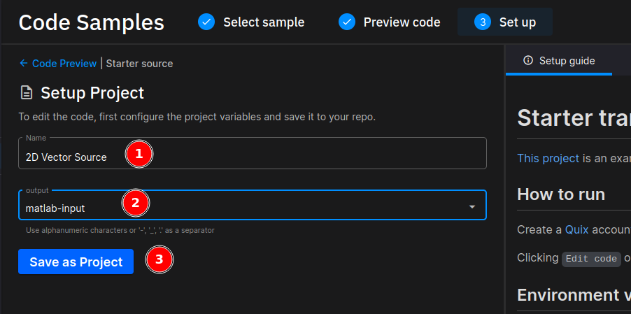
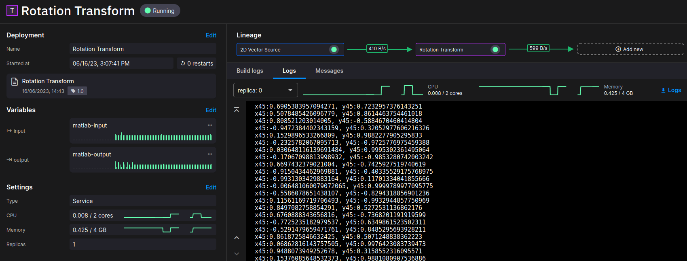
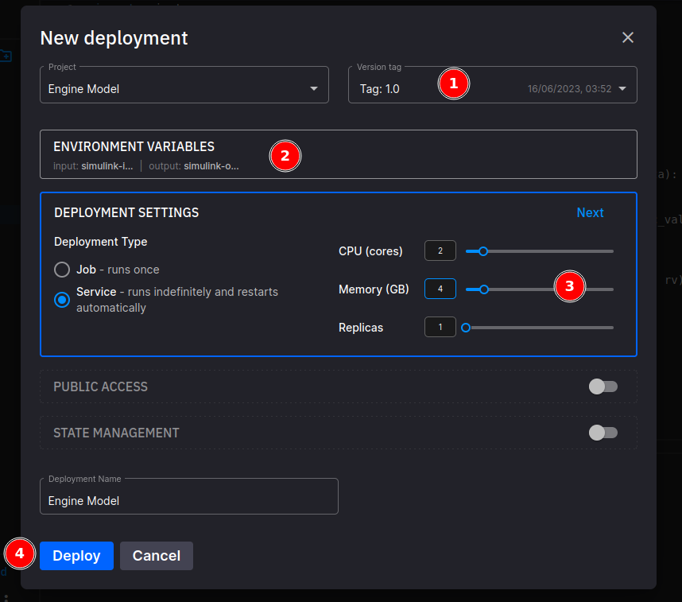
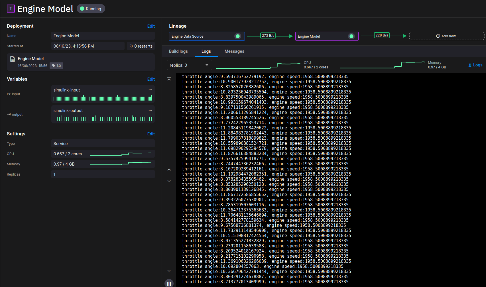

# MATLAB and Simulink

!!! warning

    This tutorial is out of date.

MATLAB and Simulink by MathWorks play an important role in scientific computing and Model-based Design in academic and industrial applications of science and technology. Ability to deploy MATLAB and Simulink applications with Quix enables engineers, scientists and researchers to develop, test, deploy and orchestrate large clusters of stream processing applications at scale.

The following sections describe how to deploy MATLAB functions and Simulink models to Quix to perform real-time analytics and simulations with MATLAB and Quix Streams.

## MATLAB

This section describes the steps for deploying a MATLAB function that rotates 2D vectors counter-clockwise by a specified angle.

### Prerequisites

* A Quix account. You can sign up for a free account from the Quix [website](https://quix.io/product/){target=_blank}.
* It is assumed you have created a Quix project and environment in which to contain your application. Alternatively, you can use a legacy workspace, but this is not recommended.
* MathWorks licenses for MATLAB, MATLAB Compiler and the MATLAB Compiler SDK.

This tutorial uses MATLAB R2023a. Please refer to the [Working with different MATLAB versions](#working-with-different-matlab-versions) section for information on how to use a different version of MATLAB.

### Preparing a MATLAB function for deployment

This section describes the process for packaging MATLAB functions for deployment. The application templates in Quix have pre-built MATLAB packages. To deploy the default packages without compiling them, go to [deploying a MATLAB function](#deploying-a-matlab-function) section.

 1. In MATLAB, create a new `*.m` file with the following function and save it as `rot.m`:
	
	```
	function M = rot(v, theta)
    	R = [cos(theta) -sin(theta); sin(theta) cos(theta)];
    	M = R * v;
	end
	```
 2. In the MATLAB command window, type the following command to compile the MATLAB function for your preferred runtime environment. For more information on compiling MATLAB functions for deployment, please refer to [MATLAB compiler documentation](https://www.mathworks.com/help/compiler/mcc.html#d124e20858){target=_blank}:

	=== "Python"
	
		``` python
		mcc -W python:quixmatlab rot.m -d py
		```

	=== "C\#"
	
		``` cs
		mcc -W 'dotnet:quixmatlab,api=matlab-data,framework_version=6.0' rot.m -d cs
		```

3. Above commands generate deployable packages for Python in `py` directory and `cs` for .NET:

 	{width=600}

### Deploying a MATLAB function

 1. Sign in to your environment in [Quix](https://portal.platform.quix.io/){target=_blank}.

 2. Click on the `Code Samples` in the left navigation panel, and search for `matlab` in the search box on the top left to filter code samples.

 3. Select the MATLAB template for your programming language of choice. Optionally, use the `LANGUAGES` filter on the left to filter templates based on the programming language.

 4. Click on the `Preview code` button to open a preview of the application, and then click on the `Edit code` button to generate an application from the template.

 5. Enter `Rotation Transform` as the application name. Enter `matlab-input` for input topic and `matlab-output` for output topic, and click `Save as Application.`

 6. To use your own MATLAB packages, replace the contents of the `MATLAB` directory in the application with your assets by clicking on the upload icon in the application explorer.

 7. Assign a tag to the application by clicking on the `add tag` icon and typing in a release tag such as `1.0`. Click on `Deploy` on the top right to open the deployment dialog:

	{width=600}

 8. In the deployment dialog, choose the release tag and ensure the environment variables are set correctly. In the `Deployment Settings`, choose `Service` for the deployment type, give at least 2 CPUs and sufficient memory (~4GB for the default template), and click on `Deploy`:

 	{width=600}

### Testing the MATLAB function

This section describes the steps to test the MATLAB function by deploying a service to generate test data. In production environments, data from sensors or the output of another function or simulation takes the place of this service.

 1. Click on the `Code Samples` on the left navigation, select `Python` under languages, and `Source` under the pipeline stage. Then type `starter` in the search box to filter the starter template for a data source. Follow the steps described in the previous section to create an application named `2D Vector Source` based on this template by clicking on `Preview code` followed by `Edit code`.

 2. Set the output topic of the application to the input topic of the deployment containing the MATLAB transformation:

	{width=600}

 3. Replace the contents of the `main.py` file of the application with the following script, which generates a random stream of 2D unit vectors:

	```python
	import quixstreams as qx
	import time
	import datetime
	import os
	import random, math

	client = qx.QuixStreamingClient()
	topic_producer = client.get_topic_producer(topic_id_or_name = os.environ["output"])

	stream = topic_producer.get_or_create_stream("vectors")
	index = 0
	while True:
	    xa = random.uniform(-1, 1)
	    ya = random.uniform(-1, 1)
	    vlen = math.sqrt(xa ** 2 + ya ** 2)
	    stream.timeseries \
	        .buffer \
	        .add_timestamp(datetime.datetime.utcnow()) \
	        .add_value("x", xa / vlen) \
	        .add_value("y", ya / vlen) \
	        .publish()
	    time.sleep(0.5)
	```
 
 4. Create a tag and deploy the `2D Vector Source`. Click `Pipeline` in the main navigation to display your pipeline:

	{width=600}

 5. Click on the `Rotation Transform` node to view the application logs and deployment details:

	{width=600}

 6. Next, click on `Data explorer` on the left-hand navigation, select `Live data` from the top menu, and select the output topic of the MATLAB transformation (for example, `matlab-output`), the stream, and the parameters as shown in the figure below to view the live transformation:

	{width=600}

## Simulink

This section describes the steps for deploying a Simulink model of an [internal combustion engine](https://www.mathworks.com/help/simulink/slref/modeling-engine-timing-using-triggered-subsystems.html){target=_blank} developed by MathWorks to Quix.

### Prerequisites

 - A Quix account. You can sign up for a free account from the Quix [website](https://quix.io/product/){target=_blank}.
 - MathWorks licenses for MATLAB, MATLAB Compiler, Simulink, Simulink Compiler and MATLAB Compiler SDK.

This tutorial uses MATLAB R2023a. Please refer to the [Working with different MATLAB versions](#working-with-different-matlab-versions) section for information on how to use a different version of MATLAB.

### Preparing a Simulink model for deployment

 1. Download the MATLAB and Simulink assets for the internal combustion engine from the MathWorks [site](https://www.mathworks.com/help/simulink/slref/modeling-engine-timing-using-triggered-subsystems.html){target=_blank} or the `samples` directory in the Quix `Code Samples` for MATLAB.
 2. Convert the input and output of the Simulink model to environment variables. For other means of interacting with Simulink programmatically, refer to [How to Bring Data from MATLAB Into Simulink](https://www.youtube.com/watch?v=kM2qL__YxBQ){target=_blank} and [Simulate a Simulink® model from Python](https://github.com/mathworks/Call-Simulink-from-Python){target=_blank}.

 	{width=600}

 3. Create a MATLAB function in `engine.m` file with the following content to bootstrap the Simulink model and prepare it for deployment:

	```
	function R = engine(throttle_angle, time)
    	ta = timeseries(throttle_angle, time);
    	assignin("base", "throttle_angle", ta);
    	si = Simulink.SimulationInput('sldemo_engine');
    	si = simulink.compiler.configureForDeployment(si);
    	sout = sim(si);
    	R = sout.engine_speed.Data(end);
	end
	```
 4. If you use environment variables to pass arguments to Simulink, create them in the environment before compiling the model. Run the following commands on the MATLAB command window to seed some input data and run the Simulink model using the `engine.m` function:

	```
	throttle_a = [0.2, 0.23, 1.2, 4.2, 5.3 ];
	ts = [1, 2, 3, 4, 5];
	engine(throttle_a, ts);
	```

 5. On the MATLAB command window, type the following command to compile the MATLAB function to your preferred runtime environment. For information on compiling MATLAB functions for deployment, please refer to [MATLAB compiler documentation](https://www.mathworks.com/help/compiler/mcc.html#d124e20858){target=_blank}:

	=== "Python"
	
		``` python
		mcc -W python:quixmatlab engine.m -d py
		```

	=== "C\#"
	
		``` cs
		mcc -W 'dotnet:quixmatlab,api=matlab-data,framework_version=6.0' engine.m -d cs
		```
 
 6. Above commands generate deployable packages for Python in `py` directory and `cs` for .NET.

### Deploying a Simulink model

 1. Sign in to the environment in [Quix](https://portal.platform.quix.io/){target=_blank}.

 2. Click on the `Code Samples` on the left navigation panel and search for `simulink` in the search bar on the top left to filter code samples (templates for MATLAB and Simulink are the same):

 3. Click on the template for your programming language of choice. You can also use the `LANGUAGES` filters on the left to filter templates based on the programming language.

 4. Click on the `Preview code` button to open a preview of the application, and then click on the `Edit code` button to generate a new application from the template.

 5. Enter `Engine Model` for the application name. Enter `simulink-input` for input topic and `simulink-output` for output topic, and click `Save as Application.`

 6. To deploy your own functions and models, replace the contents of the `MATLAB` directory in the application with your packages.

 7. Replace the contents of the main function (`main.py` for Python, `Program.cs` for C#) with the following for your target programming language. They are responsible for calling the `engine` function with the correct arguments:

	=== "Python"
	
		```python
		import quixstreams as qx
		import os
		import quixmatlab
		import matlab

		qxmlm = quixmatlab.initialize()

		client = qx.QuixStreamingClient()
		input_topic = client.get_topic_consumer(os.environ["input"])
		output_topic = client.get_topic_producer(os.environ["output"])

		def on_data_received_handler(input_stream: qx.StreamConsumer, data: qx.TimeseriesData):
		    with data:
		        for ts in data.timestamps:    
					throttle_angles = matlab.double([ts.parameters["throttle_angle"].numeric_value])
            		timestamps = matlab.double([ts.timestamp_milliseconds / 1000])
            		rv = qxmlm.engine(throttle_angles, timestamps)
            		ts.add_value("engine_speed", rv)
            		print("throttle angle:{}, engine speed:{}".format(throttle_angles[0][0], rv))
		        output_stream = output_topic.get_or_create_stream(input_stream.stream_id)
		        output_stream.timeseries.publish(data)

		def on_stream_received_handler(stream: qx.StreamConsumer):
		    print("New stream: {}".format(stream.stream_id))
		    stream.timeseries.on_data_received = on_data_received_handler

		input_topic.on_stream_received = on_stream_received_handler

		print("Listening to streams. Press CTRL-C to exit.")
		qx.App.run()
		```

	=== "C\#"
	
		```cs
		using System;
		using MathWorks.MATLAB.Runtime;
		using MathWorks.MATLAB.Types;
		using MathWorks.MATLAB.Exceptions;
		using QuixStreams.Streaming;
		using QuixStreams.Streaming.Models;

		namespace Service
		{
		    class Program
		    {
		        static void Main(string[] args)
		        {
		            dynamic matlab = MATLABRuntime.StartMATLAB("quixmatlab.ctf");

		            var quix = new QuixStreamingClient();
		            using var producer = quix.GetTopicProducer(Environment.GetEnvironmentVariable("output"));
		            using var consumer = quix.GetTopicConsumer(Environment.GetEnvironmentVariable("input"));
		            consumer.OnStreamReceived += (_, stream) =>
		            {
		                Console.WriteLine($"New stream received: {stream.StreamId}");
		                stream.Timeseries.OnDataReceived += (_, args) =>
		                {
		                    foreach (var ts in args.Data.Timestamps)
		                    {
		                        var tin = new double[] { ts.TimestampMilliseconds / 1000.0 };
		                        var din = new double[] { ts.Parameters["throttle_angle"].NumericValue.Value };
		                        double rv = matlab.engine(din, tin);
		                        ts.AddValue("engine_speed", rv);
		                        Console.WriteLine($"throttle angle:{din[0]}, engine speed:{rv}");
		                    }
		                    producer.GetOrCreateStream(stream.StreamId).Timeseries.Publish(args.Data);
		                };
		            };
		            Console.WriteLine("Listening for streams");
		            App.Run();
		            Console.WriteLine("Exiting");
		        }
		    }
		}
		```

 8. Assign a tag to the application by clicking on the `add tag` icon and typing in a release tag such as `1.0`, and clicking on `Deploy` on the top right to open the deployment dialog:

	{width=600}

 9. In the deployment dialog, choose the release tag or the commit reference and ensure the environment variables are set correctly. In the `Deployment Settings`, choose `Service` for the deployment type, give at least 2 CPU cores and sufficient memory (~4GB for the default template), and click on `Deploy` to deploy the model:

	{width=600}

### Testing the Simulink model

This section describes the steps to deploy a service to generate test data for the model. In production environments, data from sensors or output of another simulation takes the place of this service.

 1. Click on the `Code Samples` on the left navigation, select `Python` under languages, and `Source` under the pipeline stage. Then type `starter` in the search box to filter the starter template for a data source. Follow the steps described in the previous section to create an application based on this template by clicking on `Preview code` followed by `Edit code`.

 2. Set the output topic of the `Engine Data Source` to the input topic of the deployment containing the Simulink model, `simulink-input`.

 3. Replace the contents of the `main.py` file in the `Engine Data Source` application with the following script, which randomly generates a throttle angle once every second:

	```python
	import quixstreams as qx
	import time
	import datetime
	import os
	import random	
	client = qx.QuixStreamingClient()
	topic_producer = client.get_topic_producer(topic_id_or_name = os.environ["output"])
	stream = topic_producer.create_stream()	
	while True:
	    throttle_angle = random.uniform(8, 12)
	    data = qx.TimeseriesData()
	    data.add_timestamp(datetime.datetime.utcnow()) \
	        .add_value("throttle_angle", throttle_angle)
	    stream.timeseries.publish(data)
	    time.sleep(1)
	```

 4. Follow steps 8 and 9 in the preceding section to deploy the `Engine Data Source.`

	{width=600}

 5. Click on the `Engine Model` deployment to view the deployment details and application logs:

	{width=600}

 6. Next, click on `Data explorer` on the left navigation panel, select `Live data` from the top menu, and select the output topic, the stream, and the parameters as shown in the figure below to see the live simulation:

	{width=600}

## Working with different MATLAB versions

Quix supports all versions of MATLAB with support for MATLAB Runtime API. To reduce build-time, Quix [Docker Hub](https://hub.docker.com/u/quixanalytics){target=_blank} maintains images with MATLAB R2023a, Python and .NET LTS versions pre-installed. Modify the following dockerfiles to use a different version of MATLAB, Python or .NET:

=== "Python"
	
	```python
	FROM ubuntu:22.04
	ENV PYTHONUNBUFFERED=1
	ENV PYTHONIOENCODING=UTF-8

	# Python 3.10
	ENV PATH /usr/local/bin:$PATH
	ENV LANG C.UTF-8
	RUN set -eux; \
	    apt-get update; \
	    apt-get install -y --no-install-recommends \
	        ca-certificates \
	        netbase \
	        tzdata \
	    ; \
	    rm -rf /var/lib/apt/lists/*
	ENV GPG_KEY A035C8C19219BA821ECEA86B64E628F8D684696D
	ENV PYTHON_VERSION 3.10.11
	RUN set -eux; \
	    \
	    savedAptMark="$(apt-mark showmanual)"; \
	    apt-get update; \
	    apt-get install -y --no-install-recommends \
	        dpkg-dev \
	        gcc \
	        gnupg \
	        libbluetooth-dev \
	        libbz2-dev \
	        libc6-dev \
	        libdb-dev \
	        libexpat1-dev \
	        libffi-dev \
	        libgdbm-dev \
	        liblzma-dev \
	        libncursesw5-dev \
	        libreadline-dev \
	        libsqlite3-dev \
	        libssl-dev \
	        make \
	        tk-dev \
	        uuid-dev \
	        wget \
	        xz-utils \
	        zlib1g-dev \
	    ; \
	    \
	    wget -O python.tar.xz "https://www.python.org/ftp/python/${PYTHON_VERSION%%[a-z]*}/Python-$PYTHON_VERSION.tar.xz"; \
	    wget -O python.tar.xz.asc "https://www.python.org/ftp/python/${PYTHON_VERSION%%[a-z]*}/Python-$PYTHON_VERSION.tar.xz.asc"; \
	    GNUPGHOME="$(mktemp -d)"; export GNUPGHOME; \
	    gpg --batch --keyserver hkps://keys.openpgp.org --recv-keys "$GPG_KEY"; \
	    gpg --batch --verify python.tar.xz.asc python.tar.xz; \
	    gpgconf --kill all; \
	    rm -rf "$GNUPGHOME" python.tar.xz.asc; \
	    mkdir -p /usr/src/python; \
	    tar --extract --directory /usr/src/python --strip-components=1 --file python.tar.xz; \
	    rm python.tar.xz; \
	    \
	    cd /usr/src/python; \
	    gnuArch="$(dpkg-architecture --query DEB_BUILD_GNU_TYPE)"; \
	    ./configure \
	        --build="$gnuArch" \
	        --enable-loadable-sqlite-extensions \
	        --enable-optimizations \
	        --enable-option-checking=fatal \
	        --enable-shared \
	        --with-lto \
	        --with-system-expat \
	        --without-ensurepip \
	    ; \
	    nproc="$(nproc)"; \
	    EXTRA_CFLAGS="$(dpkg-buildflags --get CFLAGS)"; \
	    LDFLAGS="$(dpkg-buildflags --get LDFLAGS)"; \
	    LDFLAGS="${LDFLAGS:--Wl},--strip-all"; \
	    make -j "$nproc" \
	        "EXTRA_CFLAGS=${EXTRA_CFLAGS:-}" \
	        "LDFLAGS=${LDFLAGS:-}" \
	        "PROFILE_TASK=${PROFILE_TASK:-}" \
	    ; \
	    rm python; \
	    make -j "$nproc" \
	        "EXTRA_CFLAGS=${EXTRA_CFLAGS:-}" \
	        "LDFLAGS=${LDFLAGS:--Wl},-rpath='\$\$ORIGIN/../lib'" \
	        "PROFILE_TASK=${PROFILE_TASK:-}" \
	        python \
	    ; \
	    make install; \
	    \
	    cd /; \
	    rm -rf /usr/src/python; \
	    \
	    find /usr/local -depth \
	        \( \
	            \( -type d -a \( -name test -o -name tests -o -name idle_test \) \) \
	            -o \( -type f -a \( -name '*.pyc' -o -name '*.pyo' -o -name 'libpython*.a' \) \) \
	        \) -exec rm -rf '{}' + \
	    ; \
	    \
	    ldconfig; \
	    \
	    apt-mark auto '.*' > /dev/null; \
	    apt-mark manual $savedAptMark; \
	    find /usr/local -type f -executable -not \( -name '*tkinter*' \) -exec ldd '{}' ';' \
	        | awk '/=>/ { print $(NF-1) }' \
	        | sort -u \
	        | xargs -r dpkg-query --search \
	        | cut -d: -f1 \
	        | sort -u \
	        | xargs -r apt-mark manual \
	    ; \
	    apt-get purge -y --auto-remove -o APT::AutoRemove::RecommendsImportant=false; \
	    rm -rf /var/lib/apt/lists/*; \
	    \
	    python3 --version
	RUN set -eux; \
	    for src in idle3 pydoc3 python3 python3-config; do \
	        dst="$(echo "$src" | tr -d 3)"; \
	        [ -s "/usr/local/bin/$src" ]; \
	        [ ! -e "/usr/local/bin/$dst" ]; \
	        ln -svT "$src" "/usr/local/bin/$dst"; \
	    done
	ENV PYTHON_PIP_VERSION 23.0.1
	ENV PYTHON_SETUPTOOLS_VERSION 65.5.1
	ENV PYTHON_GET_PIP_URL https://github.com/pypa/get-pip/raw/0d8570dc44796f4369b652222cf176b3db6ac70e/public/get-pip.py
	ENV PYTHON_GET_PIP_SHA256 96461deced5c2a487ddc65207ec5a9cffeca0d34e7af7ea1afc470ff0d746207
	RUN set -eux; \
	    \
	    savedAptMark="$(apt-mark showmanual)"; \
	    apt-get update; \
	    apt-get install -y --no-install-recommends wget; \
	    \
	    wget -O get-pip.py "$PYTHON_GET_PIP_URL"; \
	    echo "$PYTHON_GET_PIP_SHA256 *get-pip.py" | sha256sum -c -; \
	    \
	    apt-mark auto '.*' > /dev/null; \
	    [ -z "$savedAptMark" ] || apt-mark manual $savedAptMark > /dev/null; \
	    apt-get purge -y --auto-remove -o APT::AutoRemove::RecommendsImportant=false; \
	    rm -rf /var/lib/apt/lists/*; \
	    \
	    export PYTHONDONTWRITEBYTECODE=1; \
	    \
	    python get-pip.py \
	        --disable-pip-version-check \
	        --no-cache-dir \
	        --no-compile \
	        "pip==$PYTHON_PIP_VERSION" \
	        "setuptools==$PYTHON_SETUPTOOLS_VERSION" \
	    ; \
	    rm -f get-pip.py; \
	    \
	    pip --version

	# MathWorks base dependencies
	ENV DEBIAN_FRONTEND="noninteractive" TZ="Etc/UTC"
	COPY --from=git /project/base-dependencies.txt /tmp/base-dependencies.txt
	RUN apt-get update && apt-get install --no-install-recommends -y `cat /tmp/base-dependencies.txt` \
	    && apt-get clean && apt-get -y autoremove && rm -rf /var/lib/apt/lists/*
	RUN [ -d /usr/share/X11/xkb ] || mkdir -p /usr/share/X11/xkb

	# MATLAB runtime
	WORKDIR /tmp
	RUN wget https://ssd.mathworks.com/supportfiles/downloads/R2023a/Release/2/deployment_files/installer/complete/glnxa64/MATLAB_Runtime_R2023a_Update_2_glnxa64.zip -O MATLAB_Runtime_R2023a_Update_2_glnxa64.zip \
	    && unzip MATLAB_Runtime_R2023a_Update_2_glnxa64.zip \
	    && ./install -agreeToLicense yes -destinationFolder /opt/matlab \
	    && rm -rf /tmp/*
	ENV LD_LIBRARY_PATH="${LD_LIBRARY_PATH}:/opt/matlab/R2023a/runtime/glnxa64:/opt/matlab/R2023a/bin/glnxa64:/opt/matlab/R2023a/sys/os/glnxa64:/opt/matlab/R2023a/sys/opengl/lib/glnxa64"
	```

=== "C\# (SDK)"
	
	```cs
	FROM mcr.microsoft.com/dotnet/sdk:6.0-jammy

	# MathWorks base dependencies
	ENV DEBIAN_FRONTEND="noninteractive" TZ="Etc/UTC"
	COPY --from=git /project/base-dependencies.txt /tmp/base-dependencies.txt
	RUN apt-get update && apt-get install --no-install-recommends -y `cat /tmp/base-dependencies.txt` \
	    && apt-get clean && apt-get -y autoremove && rm -rf /var/lib/apt/lists/*
	RUN [ -d /usr/share/X11/xkb ] || mkdir -p /usr/share/X11/xkb

	# MATLAB runtime
	WORKDIR /tmp
	RUN wget https://ssd.mathworks.com/supportfiles/downloads/R2023a/Release/2/deployment_files/installer/complete/glnxa64/MATLAB_Runtime_R2023a_Update_2_glnxa64.zip -O MATLAB_Runtime_R2023a_Update_2_glnxa64.zip \
	    && unzip MATLAB_Runtime_R2023a_Update_2_glnxa64.zip \
	    && ./install -agreeToLicense yes -destinationFolder /opt/matlab \
	    && rm -rf /tmp/*
	ENV LD_LIBRARY_PATH="${LD_LIBRARY_PATH}:/opt/matlab/R2023a/runtime/glnxa64:/opt/matlab/R2023a/bin/glnxa64:/opt/matlab/R2023a/sys/os/glnxa64:/opt/matlab/R2023a/sys/opengl/lib/glnxa64"
	```

=== "C\# (Runtime)"
	
	```cs
	FROM mcr.microsoft.com/dotnet/runtime:6.0-jammy

	# MathWorks base dependencies
	ENV DEBIAN_FRONTEND="noninteractive" TZ="Etc/UTC"
	COPY --from=git /project/base-dependencies.txt /tmp/base-dependencies.txt
	RUN apt-get update && apt-get install --no-install-recommends -y `cat /tmp/base-dependencies.txt` \
	    && apt-get clean && apt-get -y autoremove && rm -rf /var/lib/apt/lists/*
	RUN [ -d /usr/share/X11/xkb ] || mkdir -p /usr/share/X11/xkb

	# MATLAB runtime
	WORKDIR /tmp
	RUN wget https://ssd.mathworks.com/supportfiles/downloads/R2023a/Release/2/deployment_files/installer/complete/glnxa64/MATLAB_Runtime_R2023a_Update_2_glnxa64.zip -O MATLAB_Runtime_R2023a_Update_2_glnxa64.zip \
	    && unzip MATLAB_Runtime_R2023a_Update_2_glnxa64.zip \
	    && ./install -agreeToLicense yes -destinationFolder /opt/matlab \
	    && rm -rf /tmp/*
	ENV LD_LIBRARY_PATH="${LD_LIBRARY_PATH}:/opt/matlab/R2023a/runtime/glnxa64:/opt/matlab/R2023a/bin/glnxa64:/opt/matlab/R2023a/sys/os/glnxa64:/opt/matlab/R2023a/sys/opengl/lib/glnxa64"
	```

=== "Base dependencies"
	
	```
	ca-certificates libasound2 libc6 libcairo2 libcairo-gobject2 libcap2 libcrypt1 libcrypt-dev libcups2 libdrm2 libdw1 libgbm1 libgdk-pixbuf2.0-0 libgl1 libglib2.0-0 libgomp1 libgstreamer1.0-0 libgstreamer-plugins-base1.0-0 libgtk-3-0 libice6 libnspr4 libnss3 libodbc1 libpam0g libpango-1.0-0 libpangocairo-1.0-0 libpangoft2-1.0-0 libsndfile1 libsystemd0 libuuid1 libwayland-client0 libxcomposite1 libxcursor1 libxdamage1 libxfixes3 libxft2 libxinerama1 libxrandr2 libxt6 libxtst6 libxxf86vm1 linux-libc-dev locales locales-all make net-tools odbcinst1debian2 procps sudo unzip wget zlib1g
	```