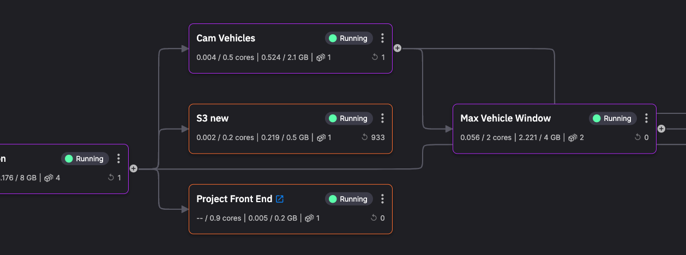

# Tutorials
 
The Quix tutorials provide you with experience of using Quix. They guide you in a step-by-step manner through a practical use case. 

Each tutorial is divided into parts, so that you can leave a tutorial at a convenient point, come back to it later, and continue where you left off.

Some tutorials use [project templates](../get-started/project-templates.md) - these are marked accordingly.

-   __Computer vision__

    ---
    
    

    `Project template`

    Real-time computer vision using TfL's JamCams.

    [Explore :octicons-arrow-right-24:](../tutorials/computer-vision/overview.md)

-   __Chat sentiment analysis__

    ---
    
    

    `Project template`

    Chat application with sentiment analysis and typing indicator.

    [Explore :octicons-arrow-right-24:](../tutorials/sentiment-analysis/overview.md)

-   __Train and deploy machine learning (ML)__

    ---

    Extract data from Quix to train your Machine Learning (ML) model in Jupyter Notebook, then deploy your solution in Quix.     

    [Explore :octicons-arrow-right-24:](../tutorials/train-and-deploy-ml/overview.md)

-   __MATLAB and Simulink__

    ---
    
    Deploy real-time MATLAB transformations and Simulink models to Quix.

    [Explore :octicons-arrow-right-24:](../tutorials/matlab/matlab-and-simulink.md)

## Need help?

If you'd like some help with a tutorial, or advice on a suitable tutorial for your use case, feel free to ask in the [Quix Forum](https://forum.quix.io/){target=_blank}!
