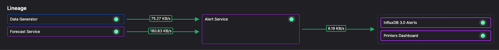
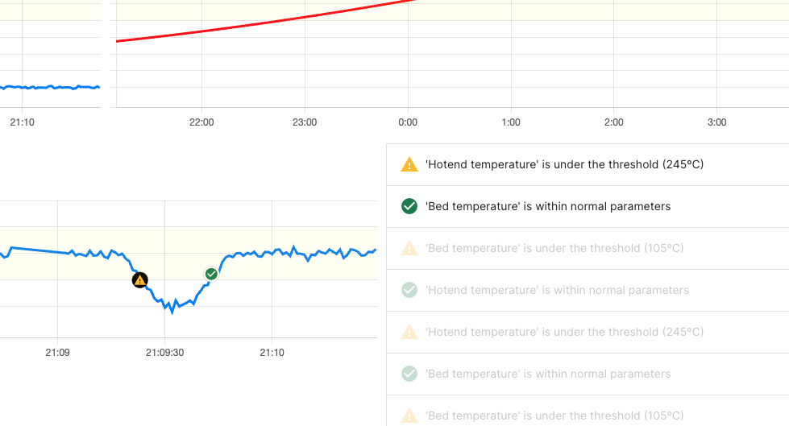
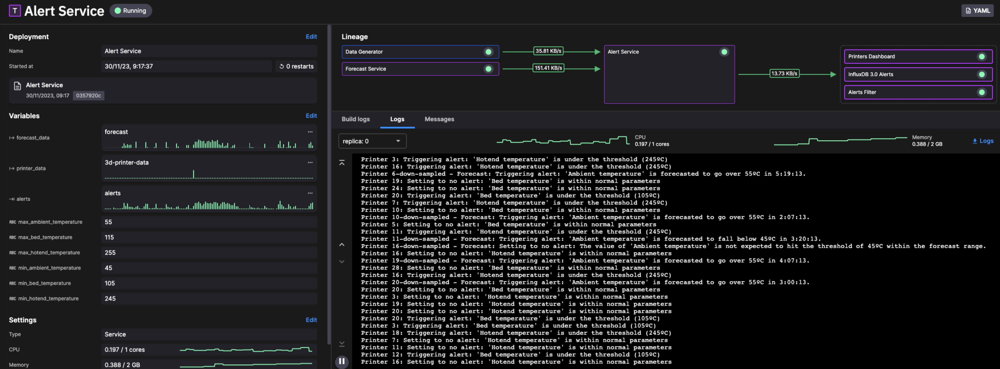
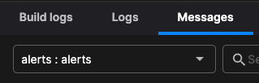
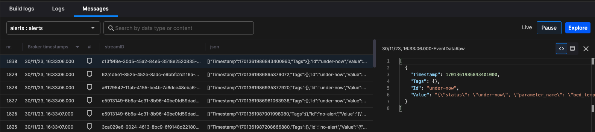

# Alert service

Sends alerts to an output topic when the temperature is under or over the threshold.

It receives data from two topics (3d printer data and forecast) and triggers an alert (to output topic `alerts`) if the temperature is under or over the threshold.



The default thresholds are as shown in the following table:

| Variable | Default value (degrees C)|
|----|----|
| min_ambient_temperature | 45|
| max_ambient_temperature | 55 |
| min_bed_temperature | 105 |
| max_bed_temperature | 115 |
| min_hotend_temperature | 245 |
| max_hotend_temperature | 255 |

These thresholds are used to determine if the temperature, or forecast temperature, are under or over the threshold values. If so these alerts are published to the `alerts` topic.

Note there are different alert types, with the message format for the `no-alert` type alert:

``` json
{
  "status": "no-alert",
  "parameter_name": "hotend_temperature",
  "message": "'Hotend temperature' is within normal parameters",
  "alert_timestamp": 1701280033000000000,
  "alert_temperature": 246.04148121958596
}
```

An example of the `under-now` alert message format:

``` json
{
  "status": "under-now",
  "parameter_name": "bed_temperature",
  "alert_timestamp": 1701273328000000000,
  "alert_temperature": 104.0852349596566,
  "message": "'Bed temperature' is under the threshold (105ºC)"
}
```

Here's an `over-forecast` alert message format:

``` json
{
  "status": "over-forecast",
  "parameter_name": "forecast_fluctuated_ambient_temperature",
  "alert_temperature": 55.014602460947586,
  "alert_timestamp": 1701278280000000000,
  "message": "'Ambient temperature' is forecasted to go over 55ºC in 1:36:29."
}
```

Here's the `under-forecast` alert message format:

``` json
{
  "status": "under-forecast",
  "parameter_name": "forecast_fluctuated_ambient_temperature",
  "alert_temperature": 44.98135836928914,
  "alert_timestamp": 1701277320000000000,
  "message": "'Ambient temperature' is forecasted to fall below 45ºC in 1:20:28."
}
```

These alerts are subscribed to by the Printers dashboard service, and the alerts can be displayed in real time on the scrolling charts, as well as the scrolling alert display:



## Check the log messages

It can be very useful to check the logs for a service. To do this from the pipeline view:

1. Click on Alert Service in the pipeline view.

2. Click the `Logs` tab.

You can now view the log messages:



## View the message format

You can also view the actual messages being transferred through the service:

1. Click the `Messages` tab.

2. You can now select either the input or oputput topic as required from the topic drop down:

    

3. You can now explore the messages. Click on a message to display it:

    

  Make sure you click the `Live` tab to continue viewing live messages.

## 🏃‍♀️ Next step

[Part 6 - InfluxDB raw data service :material-arrow-right-circle:{ align=right }](./influxdb-raw-data.md)
