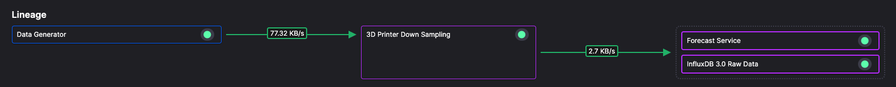

# Downsampling

This service reduces the sampling rate of data from one per second to one per minute.



The service uses a buffer to buffer data for one minute before releasing. 

``` python
# buffer 1 minute of data
buffer_configuration = qx.TimeseriesBufferConfiguration()
buffer_configuration.time_span_in_milliseconds = 1 * 60 * 1000
```

During the buffering the data is aggregated in the dataframe handler:

``` python
def on_dataframe_received_handler(originating_stream: qx.StreamConsumer, df: pd.DataFrame):
    if originating_stream.properties.name is not None and stream_producer.properties.name is None:
        stream_producer.properties.name = originating_stream.properties.name + "-down-sampled"

    # Identify numeric and string columns
    numeric_columns = [col for col in df.columns if not col.startswith('TAG__') and
                        col not in ['time', 'timestamp', 'original_timestamp', 'date_time']]
    string_columns = [col for col in df.columns if col.startswith('TAG__')]

    # Create an aggregation dictionary for numeric columns
    numeric_aggregation = {col: 'mean' for col in numeric_columns}

    # Create an aggregation dictionary for string columns (keeping the last value)
    string_aggregation = {col: 'last' for col in string_columns}

    # Merge the two aggregation dictionaries
    aggregation_dict = {**numeric_aggregation, **string_aggregation}

    df["timestamp"] = pd.to_datetime(df["timestamp"])

    # resample and get the mean of the input data
    df = df.set_index("timestamp").resample('1min').agg(aggregation_dict).reset_index()

    # Send filtered data to output topic
    stream_producer.timeseries.buffer.publish(df)
```

You can read more about using buffers in the [buffer documentation](https://quix.io/docs/quix-streams/v0-5-stable/subscribe.html#using-a-buffer).

The aggregated data is published to the output stream (one stream for each printer).

The output topic for the service is `downsampled-3d-printer-data`. Other services such as the Forecast service, and the InfluxDB raw data storage service subscribe to this topic.

## 🏃‍♀️ Next step

[Part 4 - Forecast service :material-arrow-right-circle:{ align=right }](./forecast-service.md)
