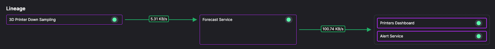

# Forecast service

Generates a forecast for the temperature data received from the input topic. This is to predict a potential failure condition, when the ambient temperature of the 3D printer drops below the minimum threshold for successful ABS-based printing.



The forecast is made using the downsampled data as the input, and using the scikit-learn library. The forecasts are published to the `forecast` topic. The Alert service and Printers dashboard service both subscribe to this topic.

## Data format

The forecast data format is:

```json
{
  "Epoch": 0,
  "Timestamps": [
    1701284880000000000,
    1701284940000000000,
    1701285000000000000,
    ...
    1701313620000000000
  ],
  "NumericValues": {
    "forecast_fluctuated_ambient_temperature": [
      42.35418149532191,
      42.43955555085827,
      42.52524883234062,
      ...
      119.79365961797913
    ]
  },
  "StringValues": {},
  "BinaryValues": {},
  "TagValues": {
    "printer": [
      "Printer 19-down-sampled",
      "Printer 19-down-sampled",
      "Printer 19-down-sampled",
      ...
      "Printer 19-down-sampled"
    ]
  }
}
```

## Prediction algorithm

The work of the prediction is carried out by the `scikit-learn` library, using a quadratic polynomial (second order) linear regression algorithm:

``` python
forecast_input = df[parameter_name]

# Define the degree of the polynomial regression model
degree = 2
# Create a polynomial regression model
model = make_pipeline(PolynomialFeatures(degree), LinearRegression())
# Fit the model to the data
model.fit(np.array(range(len(forecast_input))).reshape(-1, 1), forecast_input)
# Forecast the future values
forecast_array = np.array(range(len(forecast_input), len(forecast_input) + forecast_length)).reshape(-1, 1)
forecast_values = model.predict(forecast_array)
# Create a DataFrame for the forecast
fcast = pd.DataFrame(forecast_values, columns=[forecast_label])
```

## 🏃‍♀️ Next step

[Part 5 - Alert service :material-arrow-right-circle:{ align=right }](./alert-service.md)
