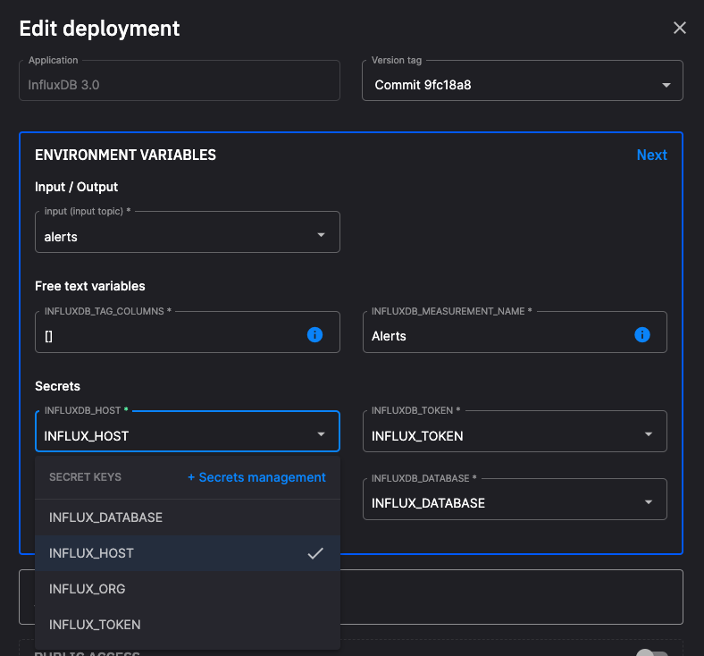

# Get the project

While you can see the [deployed project running in Quix](https://portal.platform.quix.io/pipeline?token=pat-7381f57aaee34adf95382c3a60df6306&workspace=demo-predictivemaintenance-production){target=_blank}, it can be useful to learn how to get a project up and running in your own Quix account. 

Once you have the project running in your Quix account, you can modify the project as required, and save your changes to your copy of the project. 

## Clone the project

See the [clone a project documentation](../../create/clone-project.md) for further information on how to do this.

## Add secrets

You'll need to configure the following credentials for each Quix service that needs them:

| Environment Variable (secret) | Service(s) | Description|
|---|---|---|
| `INFLUXDB_DATABASE` | InfluxDB raw data, InfluxDB alerts | Database name in InfluxDB where data should be stored. |
| `INFLUXDB_HOST` | InfluxDB raw data, InfluxDB alerts | Host address for the InfluxDB instance. Default: `eu-central-1-1.aws.cloud2.influxdata.com`. |
| `INFLUXDB_ORG` | InfluxDB raw data, InfluxDB alerts | Organization name in InfluxDB. |
| `INFLUXDB_TOKEN` | InfluxDB raw data, InfluxDB alerts | Authentication token to access InfluxDB. |
| `bearer_token` | Printers dashboard | A [PAT](../../develop/authentication/personal-access-token.md) that the web app uses to authenticate the Streaming Reader and Streaming Writer APIs. |

The above is a list of environment variables that are configured as secrets (rather than, for example, free text variables). After you've forked your project, you will see a "missing secret" error for each environment variable that does not have its secret value configured.

You need to [create secrets](../../deploy/secrets-management.md) for these and then assign them to the corresponding [environment variables](../../deploy/environment-variables.md).

To create the secrets:

1. Click on Settings in the botton left-hand corner of the Quix UI.

2. Scroll down to the bottom of the screen and click on `Secrets management`.

3. In the `Secrets management` dialog, click `+ New secret` and use this to create the following secrets (key value pairs) based on your InfluxDB account:

    * `INFLUXDB_DATABASE`
    * `INFLUXDB_HOST`
    * `INFLUXDB_ORG`
    * `INFLUXDB_TOKEN`

4. Also create a secret for `bearer_token` - the value will be a PAT. You can learn how to generate a PAT [here](../../develop/authentication/personal-access-token.md).

These secrets are then automatically assigned to their corresponding environment variables.

If you have named your secrets slightly differently to the environment variable names, you can still assign the secrets to environment variables by using the dropdown in the Deployment dialog:

assign

!!! note

    You will need to restart services (if they are running) where you have just added a secret.

## 🏃‍♀️ Next step

[Part 2 - Data generator service :material-arrow-right-circle:{ align=right }](./data-generator.md)
