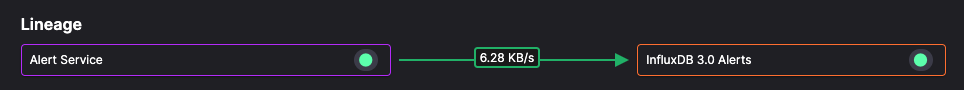
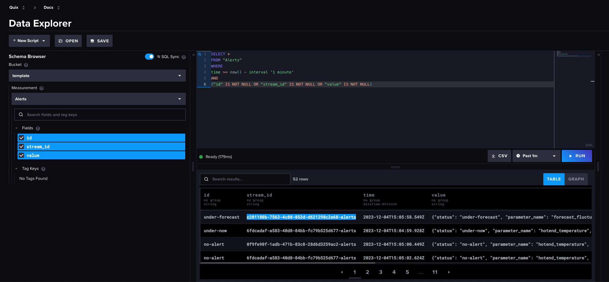

# InfluxDB - alerts

This service uses the standard Quix InfluxDB 3.0 [connector](../../connectors/index.md). This connector enables the service to subscribe to messages on a Quix topic to be stored in InfluxDB.

In this pipeline the connector subscribes to the `json-alerts` topic, and writes these messages into InfluxDB for permanent storage.

## Query the data in InfluxDB

Log into your InfluxDB account. Go to the data explorer, select the Measurement `Alerts`, and then construct a query to examine the data being stored in your database. For example:

Explore the table of data to ensure you are familiar with the data stored.

## 🏃‍♀️ Next step

<!-- [Part 8 - Printers dashboard :material-arrow-right-circle:{ align=right }](./printers-dashboard.md) -->
[Part 8 - Summary :material-arrow-right-circle:{ align=right }](./summary.md)
