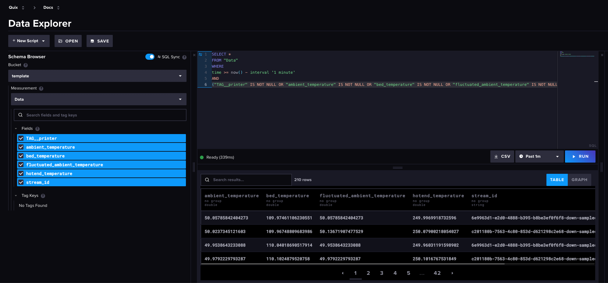

# InfluxDB - raw data

This service uses the standard Quix InfluxDB 3.0 [connector](../../quix-connectors/templates/index.md). This connector enables the service to subscribe to messages on a Quix topic to be stored in InfluxDB.

In this pipeline the connector subscribes to the `json-downsampled-3d-printer-data` topic, and writes these messages into InfluxDB for permanent storage.

## Query the data in InfluxDB

Log into your InfluxDB account. Go to the data explorer, select the Measurement `Data`, and then construct a query to examine the data being stored in your database. For example:

Explore the table of data to ensure you are familiar with the data stored.

## 🏃‍♀️ Next step

[Part 7 - InfluxDB alerts service :material-arrow-right-circle:{ align=right }](./influxdb-alerts.md)
