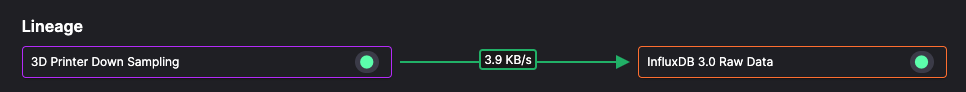

# InfluxDB - raw data

This service uses the standard Quix InfluxDB 3.0 [connector](../../connectors/index.md). This connector enables the service to subscribe to messages on a Quix topic to be stored in InfluxDB.

In this pipeline the connector subscribes to the `downsampled-3d-printer-data` topic, and writes these messages into InfluxDB for permanent storage.

## Query the data in InfluxDB

TODO (need working tutorial branch) - show data in InfluxDB

## 🏃‍♀️ Next step

[Part 7 - InfluxDB alerts service :material-arrow-right-circle:{ align=right }](./influxdb-alerts.md)
