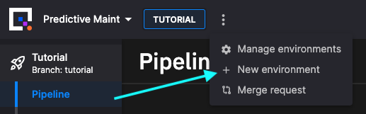
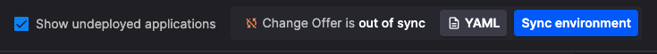
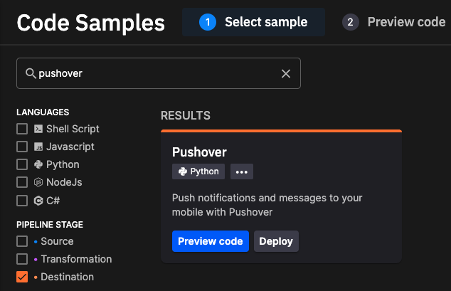
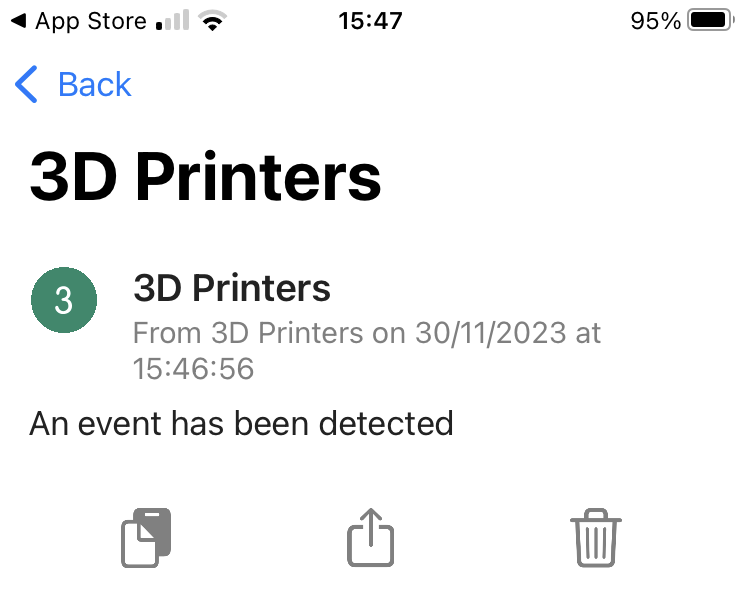
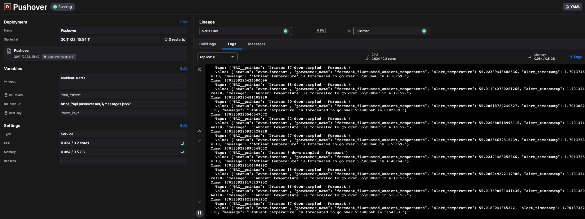
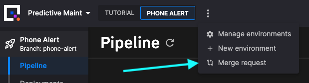

# 👩‍🔬 Lab: add phone alerts

In this lab you use what you've learned so far, to add a new service, that can send alerts to your phone. 

You develop this change on a feature branch, and then you create a PR to merge your new feature into the `tutorial` branch after testing. 

This is a common pattern for development - you can test your new service on the feature branch, and then test again, before final integration into the production `main` branch.

## Create an environment

To create a new environment (and branch):

1. Click `+ New environment` to create a new environment (note, your screen will look slightly different to the one shown here):

    

2. Create a new environment called `Phone Alert`.

3. Create a new branch called `phone-alert`. To do this, from the branch dropdown click `+ New branch` which displays the New branch dialog.

    !!! important

        Make sure you branch from the `tutorial` branch, not `main`, as you are going to merge your changes back to the `tutorial` branch.

4. Complete creation of the environment using the default options.

5. On the projects screen, click your newly created environment, `Phone Alert`.

## Sync the environment

You now see that the Quix environment is out of sync with the Git repository. You need to synchronize the Quix view of the environment, with that stored in the repository. 

To synchronize Quix with the repository:

1. Click `Sync environment`:

    

    The sync environment dialog is displayed, showing you the changes that are to be made to the `quix.yaml` file, which is the configuration file that defines the pipeline.

2. Click `Sync environment`, and then `Go to pipeline`. 

    In the pipeline view, you see the services building. Ensure all services are "Running" before continuing.

## Add an alert filter tranformation service

It would not be a good thing if your phone was alerting you for every alert produced by the alert service. For this reason, this service is used to filter alerts to only publish the ambient forecast over temperature alert. That is the alert produced when the ambient temperature goes above a safe level.

To add a filter transformation service:

1. Click on the `Code Samples` icon in the left-hand navigation.

2. Select `Transformation` and `Basic Templates`, then click `Starter transformation`. 

3. Click `Edit code`, and set the `Application name` to `Alerts Filter`, and click `Save`.

You'll now edit the code to implement the functionality you require.

Modify your input topic to be `alerts`, and the output topic to be a new topic `ambient-alerts` (you'll need to use the `New topic` button to create this).

You're only interested in forecast over temperature alerts, which have the message format:

``` json
[
  {
    "Timestamp": 1701348695725335000,
    "Tags": {
      "TAG__printer": "Printer 11-down-sampled - Forecast"
    },
    "Id": "over-forecast",
    "Value": "{\"status\": \"over-forecast\", \"parameter_name\": \"forecast_fluctuated_ambient_temperature\", \"alert_temperature\": 55.00501762733715, \"alert_timestamp\": 1.70137236e+18, \"message\": \"'Ambient temperature' is forecasted to go over 55\\u00baC in 6:34:24.\"}"
  }
]
```

So you are looking for an `Id` of `over-forecast`.

You only want to publish the alert message to the poutput topic if it has the correct ID. Modify the event handler to the following:

``` python
def on_event_data_received_handler(stream_consumer: qx.StreamConsumer, data: qx.EventData):
    if data.id == 'over-forecast':
        print(data)
        stream_producer = topic_producer.get_or_create_stream(stream_id = stream_consumer.stream_id)
        stream_producer.events.publish(data)
```

Commit your changes.

### Test the service

Now that you've modified the code, you'll now test your changes:

1. Tag your changes, for example as `alerts-filter-v1`.

2. Click the `Deploy` button and select your changed version from the `Version tag` dropdown.

3. Once the `Alerts Filter` service is running, you are ready to proceed to the next step. 

## Add the Pushover destination

In this section you create a destination service that sends a push notification when an alert condition occurs. 

This microservice reads from the `ambient-alerts` topic and whenever a new message arrives, it sends a push notification to the Pushover app on your mobile phone.

It also reads the contents of the message and enriches the notification with details on how the threshold was crossed, that is, whether the price is moving up or down.

To set up the push notification service, follow these steps:

1. Click on the `Code Samples` icon in the left-hand navigation.

2. In the search box on the Code Samples page, enter "Pushover".
   
      You will see the `Pushover Output` sample appear in the search results: 
      
      

3. Click the `Preview code` button, and on the page that appears, click the `Edit code` button.

4. On the `Setup application` page, complete the following fields:
   
    | Field | Value |
    | --- | --- |
    | `Name` | Enter an application name or keep the default suggestion. |
    | `Input` | Select the input topic. In this case, select `ambient-alerts` from the list. Every message will be read from this topic, and turned into a push notification. |
    | `base_url` | Leave the default value, `https://api.pushover.net/1/messages.json?`. If you decide to use another push notification app, your can always update this value. |
    | `api_token` | Enter the API token that you generated for this application in your Pushover dashboard. For example: `azovmnbxxdxkj7j4g4wxxxdwf12xx4`. |
    | `user_key` | Enter the user key that you received when you signed up with Pushover. For example: `u721txxxgmvuy5dxaxxxpzx5xxxx9e` |

5. Click the `Save as Application`. You now have a copy of the Pushover notification sample in your environment.

6. Click the `Deploy` button.

### Test the service

You will shortly start receiving Pushover notifications on your phone, as shown here:

{width=60%}

If you want to change the message received you can edit the `quix_function.py` code in the Pushover destination:

``` python
# Callback triggered for each new event
def on_event_data_handler(self, stream_consumer: qx.StreamConsumer, data: qx.EventData):
    print(data)

    # send your push message
    try:
        pushmsg = {'token': self.apitoken,
                    'user': self.userkey,
                    'message': 'An event has been detected'}
        requests.post(self.baseurl, json = pushmsg)
    except Exception as e:
        print(f"Error connecting to push API: {e}")
```

Change "An event has been detected" to anything you like.

!!! note

    In Pushover this application was named "3D Printers".

Depending on the stage of the printing cycle, it might take a few minutes for you to get a notification. While you are waiting to receive a notification, you can inspect the logs, as shown previously.



* Don't worry if the logs only show "_Listening to Stream_" initially — remember that the Alert Filter service only writes a message to the `ambient-alerts` topic when the ambient predicted temperature is over the threshold.
* This means that the `ambient-alerts` stream might be empty for a short while, until a threshold is triggered.

## Merge the feature

Once you are sure that the changes on your feature branch are tested, you can then merge your changes onto the `tutorial` branch. Here your changes undergo further tests before finally being merged into production. 

To merge your feature branch, `phone-alert` into `tutorial`:

1. Select `Merge request` from the menu as shown:

    

2. In the `Merge request` dialog, set the `phone-alert` branch to merge into the `tutorial` branch.

You are going to create a pull request, rather than perform a direct merge. This enables you to have the PR reviewed in GitHub (or other Git provider). You are also going to do a squash and merge, as much of the feature branch history is not required.

To create the pull request:

1. Click `Create pull request`. You are taken to your Git provider, in this case GitHub.

2. Click the `Pull request` button.

3. Add your description, and then click `Create pull request`.

4. Get your PR reviewed and approved. Then squash and merge the commits:

    

    You can replace the prefilled description by something more succinct. Then click `Confirm squash and merge`.

    !!! tip

        You can just merge, you don't have to squash and merge. You would then retain the complete commit history for your service while it was being developed. Squash and merge is used in this case by way of example, as the commit messages generated while the service was being developed were deemed to be not useful in this case.

## Resync the environment

You have now merged your new service into the `tutorial` branch in the Git repository. Your Quix view in the Tutorial environment is now out of sync with the Git repository. If you click on your Tutorial environment in Quix, you'll see it is now a commit (the merge commit) behind.

You now need to make sure your Tutorial environment in Quix is synchronized with the Git repository. To do this:

1. Click on `Sync environment`. The `Sync environment` dialog is displayed.

2. Review the changes and click `Sync environment`.

3. Click `Go to pipeline`.

Your new service builds and starts in the Tutorial environment, where you can now carry out further testing. When you are satisfied this feature can be released to production, you would then repeat the previous process to merge your changes to Production `main`.

## 🏃‍♀️ Next step

[Part 10 - Summary :material-arrow-right-circle:{ align=right }](summary.md)

