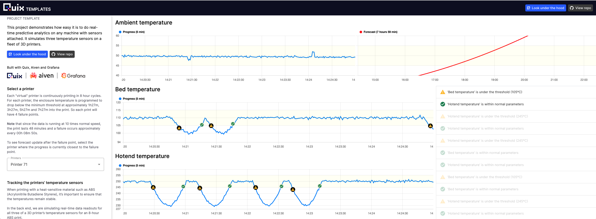
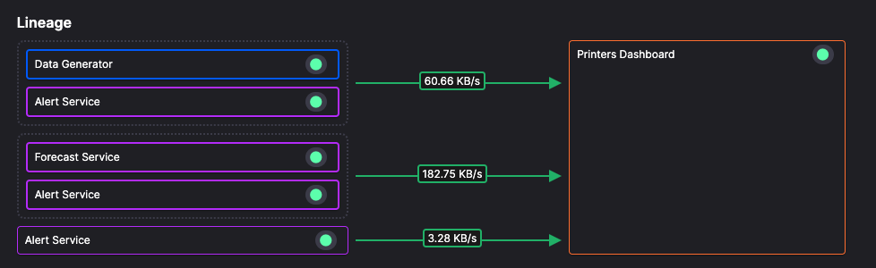

# Printers dashboard

The printers dashboard service is a web app that displays the temperature of the selected printer in real time:

The Quix [Streaming Reader API](../../apis/streaming-reader-api/overview.md) is used to subscribe to several topics, to read data into the web app.

The topics subscribed to are:

* `alerts`
* `forecast`
* `3d-printer-data`

You can see the dashboard running [here](https://dash-demo-predictivemaintenance-production.deployments.quix.io/?_ga=2.114191879.1628320822.1701679251-1544698923.1686060578){target=_blank}.

## 🏃‍♀️ Next step

[Part 9 - Lab: Add phone alert :material-arrow-right-circle:{ align=right }](./phone-alerts.md)
