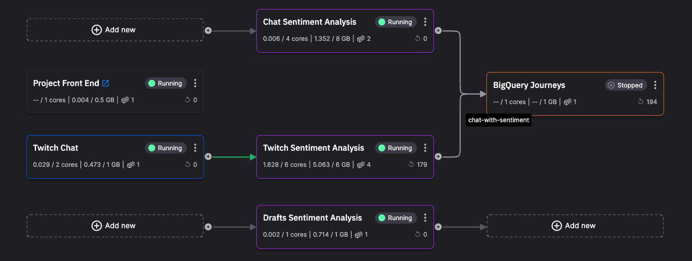

# Chat sentiment analysis

In this tutorial you learn about a real-time chat sentiment analysis application, using a [Quix template project](https://github.com/quixio/chat-demo-app){target=_blank}. 

Sentiment analysis is performed on chat messages. The project includes a chat UI, where you can type chat messages. You can also connect to Twitch and perform sentiment analysis on large volumes of messages.

You learn how to get the project, try out the UI, look more deeply into the UI and the sentiment analysis service, and then customize the UI.

<a class="md-button md-button--primary" href="https://portal.platform.quix.io/pipeline?workspace=demo-chatappdemo-prod&token=eyJhbGciOiJSUzI1NiIsInR5cCI6IkpXVCIsImtpZCI6Ik1qVTBRVE01TmtJNVJqSTNOVEpFUlVSRFF6WXdRVFF4TjBSRk56SkNNekpFUWpBNFFqazBSUSJ9.eyJodHRwczovL3F1aXguYWkvb3JnX2lkIjoiZGVtbyIsImh0dHBzOi8vcXVpeC5haS9vd25lcl9pZCI6ImF1dGgwfDI4YWQ4NWE4LWY1YjctNGFjNC1hZTVkLTVjYjY3OGIxYjA1MiIsImh0dHBzOi8vcXVpeC5haS90b2tlbl9pZCI6ImMzNzljNmVlLWNkMmYtNDExZC1iOGYyLTMyMDU0ZDc5MTY2YSIsImh0dHBzOi8vcXVpeC5haS9leHAiOiIxNzM3ODI5NDc5LjIyMyIsImlzcyI6Imh0dHBzOi8vYXV0aC5xdWl4LmFpLyIsInN1YiI6ImtyMXU4MGRqRllvUUZlb01nMGhqcXZia29lRkxFRDVBQGNsaWVudHMiLCJhdWQiOiJxdWl4IiwiaWF0IjoxNjk1NzE2MDI4LCJleHAiOjE2OTgzMDgwMjgsImF6cCI6ImtyMXU4MGRqRllvUUZlb01nMGhqcXZia29lRkxFRDVBIiwiZ3R5IjoiY2xpZW50LWNyZWRlbnRpYWxzIiwicGVybWlzc2lvbnMiOltdfQ.Ndm0K2iNHPxDq1ohF-yb-6LzIqx_UY8Ptcq0kAwSNye12S3deX_eDkC4XqZqW2NoSLd3GsmWV9PZGetGGp2IlqshQFZtUMp6WP6hq917ZC1i8JFx93PAbY7NT_88nFDovVlaRcoTpWvI-03KbryLkAoB28c6qb3EFwjCWFBuy_yA4yjQ8uF0-AZ0R9Qi4IBaekXWqcgO0a91gVRg0oA_hnzJFoR-EnZ2G1ZSxtuVgnyyPuQTMUvzJuUT_IJTLzEB_kejX0pcXRZBIwHP8MWLB4mE5DtIdz4jm8WIA4eZJZ7ZCG4dk-adQwZ2BdkNknV5eEwRgRJL4ybaplkaDlR-dg" target="_blank" style="margin-right:.5rem;">See the project running in Quix</a>

<a class="md-button md-button" href="https://sentimentdemoui-demo-chatappdemo-prod.deployments.quix.io/chat" target="_blank" style="margin-right:.5rem;">See the deployed project</a>
 

## Technologies used

Some of the technologies used by this template project are listed here.

**Infrastructure:** 

* [Quix](https://quix.io/){target=_blank}
* [Docker](https://www.docker.com/){target=_blank}
* [Kubernetes](https://kubernetes.io/){target=_blank}

**Backend:** 

* [Redpanda Cloud](https://redpanda.com/redpanda-cloud){target=_blank}
* [Quix Streams](https://github.com/quixio/quix-streams){target=_blank}
* [Flask](https://flask.palletsprojects.com/en/2.3.x/#){target=_blank}
* [pandas](https://pandas.pydata.org/docs/reference/api/pandas.DataFrame.html){target=_blank}

**Sentiment analysis:**

* [Hugging Face](https://huggingface.co/){target=_blank}

**Frontend:**

* [Angular](https://angular.io/){target=_blank}
* [Typescript](https://www.typescriptlang.org/){target=_blank}
* [Microsoft SignalR](https://learn.microsoft.com/en-us/aspnet/signalr/){target=_blank}

**Data warehousing:**

* [BigQuery](https://cloud.google.com/bigquery/){target=_blank}

## GitHub repository

The complete code for this project can be found in the [Quix GitHub repository](https://github.com/quixio/chat-demo-app){target="_blank"}.

## Getting help

If you need any assistance while following the tutorial, we're here to help in the [Quix Community](https://quix.io/slack-invite){target="_blank"}.

## Prerequisites

To get started make sure you have a [free Quix account](https://portal.platform.quix.io/self-sign-up).

### Twitch API key

You'll also need an API key for the [Twitch](https://dev.twitch.tv/docs/api/) service (optional), if you want to try Twitch-related features.

### BigQuery credentials

If you want to use the Quix BigQuery service (optional), you'll need to provide your credentials for accessing [BigQuery](https://cloud.google.com/bigquery/){target=_blank}.

### Git provider

You also need to have a Git account. This could be GitHub, Bitbucket, GitLab, or any other Git provider you are familar with, and that supports SSH keys. The simplest option is to create a free [GitHub account](https://github.com){target=_blank}.

!!! tip

    While this tutorial uses an external Git account, Quix can also provide a Quix-hosted Git solution using Gitea for your own projects. You can watch a video on [how to create a project using Quix-hosted Git](https://www.loom.com/share/b4488be244834333aec56e1a35faf4db?sid=a9aa124a-a2b0-45f1-a756-11b4395d0efc){target=_blank}.

    ??? "Transcript"

        0:01 Hi there, welcome to this video on creating a quick project. I should point out before I get into this video that I'm using the beta development environment at Quix and so what you see may be slightly different when you're testing Quicks.

        0:21 Okay, so having said that I'll get straight into creating a new project. You can see this button over here. I'm going to click that to create a new project.

        0:33 The new workflow in Quix starts with creating a project. Everything is done inside a project. Generally speaking, I'm simplifying it quite a lot.

        0:44 A project corresponds to a Git repository. So everything that you create, including your pipeline configuration and so on, will be stored in a Git repository.

        0:59 So I'll give my project a name and I'll call it video project. And the first thing I need to do is specify where this Git repository is going to be.

        1:12 Now, the simplest option is to get quick to do all the work for you and just create the Git repository.

        1:21 And the second thing I need to do is a product called gitty to host the Git repository. So we can do that for you.

        1:27 It all happens in the background. And as you'll see in later videos, you have complete control about what happens in that repository.

        1:37 You can review pull requests and do, merges and all of those normal things that you would do in a Git workflow.

        1:47 The other option is to use an external provider. So for example, you could use GitLab, GitHub, Bitbucket and so on.

        1:57 You can use any provider that supports the use of an SS. H key. For the purposes of this video, I'm going to keep it simple for now and just use the Quix manage Git.

        2:11 So I'm now ready to create the project. Now every project will have at least one environment and usually several environments.

        2:28 So what is an environment? An environment roughly corresponds to a branch in your Git repository, but there's a specific for an environment.

        2:41 As well as you'll see as we go through this dialogue. But the first thing we need to do is give our environment a name.

        2:52 So I'm going to name it. Based on the typical development workflow, so usually we'd have production. Branch or environment and you might have staging and development.

        3:09 So I'm going to create the production environment and as I was saying earlier, that's going to roughly correspond to a branch.

        3:17 So in this next section, we're going to specify the, ,branch that this environment corresponds to and I want production to correspond to the main branch.

        3:30 And so there's nothing really I need to do here. I could create a new branch if I wanted to, ,but I want to use the default branch which is main.

        3:41 The other, thing that I can do here is protect this branch and what that means is that prevents developers from merging or committing content, making changes directly to the main branch.

        3:58 In order to change the main branch you'll have to raise, a pull request, a git pull request and that would have to be reviewed and approved and then merged in the usual way.

        4:13 So we definitely want that because for production we don't want changes being made directly. So I'm protecting that and you'll, We'll see later how we go about taking changes that we've made and say the develop branch or the dev branch and merge those into the main branch.

        4:32 I'll cover that in another video. So for now let's just click continue. Now for each environment that you create you can specify how you want to host Kafka.

        4:45 Now as you probably know Quix uses Kafka as its broker. And you have several options here. You if you want the simplest option and most convenient option is to just let Quix do all the hard work for you.

        5:01 We will create them. Kafka broker and you don't need to do any configuration. We just do it all for you.

        5:08 We make sure that scales nicely as well. We use Kubernetes and you know as I say it's the least. It's it's the quickest option especially.

        5:22 If you're testing things out, but there are other options as you can see here. You can use your own self hosted Kafka or you can connect to a Confluent Cloud and we'll cover those options in later videos.

        5:39 So for now, I'm just going to go with the simplest option and click. Continue. The other thing that you'll need to do here is specify the storage option for the environment.

        5:51 So the key thing to point out at this point is we were talking about environments as corresponding to a branch in get.

        6:02 That is true, but it's also these other things like the Kafka options that you select and also the storage options.

        6:11 Now the storage option that you're selecting here is for any data that you might possess. So in Quix it's possible to persist the data that's published to topics.

        6:27 You can store that using our something called the data catalog and if you store, if you persist your topics and store the messages that are in the topics.

        6:43 In our storage facilities, then there's a small charge associated with that. However, you don't have to persist topics. You can use external database solutions for storage of your data.

        7:01 So you can use. Some of our standard connectors or even write your own connector to connect to more or less any database technology that you want.

        7:11 The other thing that's stored here is metadata associated with messages. So for now, I'm just going to choose the standard option and create.

        7:23 The environment. Okay, that's it. We'll wait for the project and the environment to be created. And then we'll have a look at what's in there in subsequent videos.

        7:42 Okay, thanks for watching. And see you in the next video.

## The pipeline

The main services in the [pipeline](https://portal.platform.quix.io/pipeline?workspace=demo-chatappdemo-prod&token=eyJhbGciOiJSUzI1NiIsInR5cCI6IkpXVCIsImtpZCI6Ik1qVTBRVE01TmtJNVJqSTNOVEpFUlVSRFF6WXdRVFF4TjBSRk56SkNNekpFUWpBNFFqazBSUSJ9.eyJodHRwczovL3F1aXguYWkvb3JnX2lkIjoiZGVtbyIsImh0dHBzOi8vcXVpeC5haS9vd25lcl9pZCI6ImF1dGgwfDI4YWQ4NWE4LWY1YjctNGFjNC1hZTVkLTVjYjY3OGIxYjA1MiIsImh0dHBzOi8vcXVpeC5haS90b2tlbl9pZCI6ImMzNzljNmVlLWNkMmYtNDExZC1iOGYyLTMyMDU0ZDc5MTY2YSIsImh0dHBzOi8vcXVpeC5haS9leHAiOiIxNzM3ODI5NDc5LjIyMyIsImlzcyI6Imh0dHBzOi8vYXV0aC5xdWl4LmFpLyIsInN1YiI6ImtyMXU4MGRqRllvUUZlb01nMGhqcXZia29lRkxFRDVBQGNsaWVudHMiLCJhdWQiOiJxdWl4IiwiaWF0IjoxNjk1NzE2MDI4LCJleHAiOjE2OTgzMDgwMjgsImF6cCI6ImtyMXU4MGRqRllvUUZlb01nMGhqcXZia29lRkxFRDVBIiwiZ3R5IjoiY2xpZW50LWNyZWRlbnRpYWxzIiwicGVybWlzc2lvbnMiOltdfQ.Ndm0K2iNHPxDq1ohF-yb-6LzIqx_UY8Ptcq0kAwSNye12S3deX_eDkC4XqZqW2NoSLd3GsmWV9PZGetGGp2IlqshQFZtUMp6WP6hq917ZC1i8JFx93PAbY7NT_88nFDovVlaRcoTpWvI-03KbryLkAoB28c6qb3EFwjCWFBuy_yA4yjQ8uF0-AZ0R9Qi4IBaekXWqcgO0a91gVRg0oA_hnzJFoR-EnZ2G1ZSxtuVgnyyPuQTMUvzJuUT_IJTLzEB_kejX0pcXRZBIwHP8MWLB4mE5DtIdz4jm8WIA4eZJZ7ZCG4dk-adQwZ2BdkNknV5eEwRgRJL4ybaplkaDlR-dg){target_blank} are:

1. *UI* - provides the chat UI, and shows the sentiment being applied to the chat messages.

2. *Sentiment analysis* - uses the [Hugging Face](https://huggingface.co/) model to perform sentiment analysis on the chat messages. There is also a *Drafts sentiment analysis* service for messages being typed, but not yet sent.

3. *Twitch data source* - An alternative to typing chat messages - you select a Twitch channel and then perform sentiment analysis on Twitch messages.

## The parts of the tutorial

This tutorial is divided up into several parts, to make it a more manageable learning experience. The parts are summarized here:

1. [Get the project](get-project.md) - you get the project up and running in your Quix account. 

2. [Try the UI](try-the-ui.md) - you try the UI, typing in chat messages and observing the sentiment analysis in operation.

3. [Explore the UI service](ui-service.md) - explore UI service and gateways...

4. [Explore the sentiment analysis service](sentiment-analysis-service.md) - you take a closer look at the sentiment analysis service, its code, and messages.

5. [Explore ther Twitch service](twitch-service.md) - you explore the service that interfaces Quix with Twitch using the [Twitch API](https://dev.twitch.tv/docs/api/){target=_blank}.

6. [Customize the UI](customize-the-ui.md) - you carry out a simple customization to the chat UI on a feature branch, and then merge your changes onto the `tutorial` branch.

7. [Summary](summary.md) - you are presented with a summary of the work you have completed.

## 🏃‍♀️ Next step

[Part 1 - Get the project :material-arrow-right-circle:{ align=right }](get-project.md)
