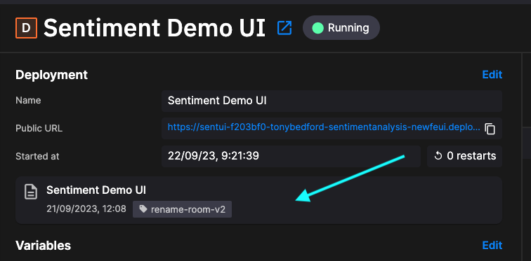

# Try the UI

!!! warning

    This tutorial is out of date. Please check the [tutorials overview](../overview.md) for our latest tutorials.

In this part of the tutorial you try out the UI to get a feel for the project and what it does.

!!! tip

    In the pipeline view, you can always determine a topic name by hovering over the connecting line that represents that topic. You can also click the connecting line, to see its name, and optionally to jump to the Data Explorer to view live data for the topic.

## Prerequisites

!!! tip

    If you just want to try out the UI without performing the following steps, you can do that in the [deployed project](https://sentimentdemoui-demo-chatappdemo-prod.deployments.quix.io/chat){target=_blank}.

You need a [PAT](../../apis/streaming-reader-api/setup.md#personal-access-token-pat) to get the UI working.

Once you have this, you'll need to create a secret, and then use this secret in the `bearer_token` environment variable.

[Read about environment variables and secret management](../../deploy/environment-variables.md).

## Try out the UI in your Quix account

Now try out the UI you just deployed. To do this:

1. In the pipeline view find the UI service tile:

	{width=200px}

2. In the service tile, click the external link icon to launch the UI in a new tab.

3. Enter your username (it can be anything) and then type in some messages. Note that the typing indicator displays the sentiment as you type your message.

4. Type various messages and check the sentiment is as expected. Also note that the sentiment analysis is shown in the real-time graph display.

5. Select a different source from the `Message source` dropdown, and observe the messages and corresponding sentiment analysis graph change in real time.

## 👩‍🔬 Lab - examine the code

There are various ways you can view the code for this service. For example:

1. Click `Pipeline` in the left-hand navigation to go to the pipeline view.

2. Click the UI code panel as shown:

	{width=60%}

3. The code is displayed in the built-in editor. You can navigate the codebase using the file explorer. The code view also has Intellisense built in - hover over a code construct to see more details.

## 🏃‍♀️ Next step

[Part 3 - Explore the UI service  :material-arrow-right-circle:{ align=right }](ui-service.md)