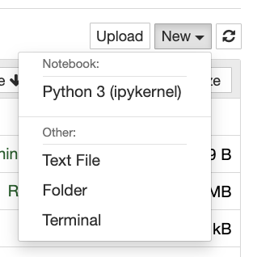
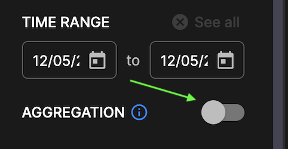
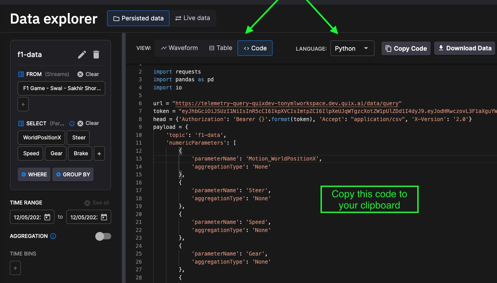
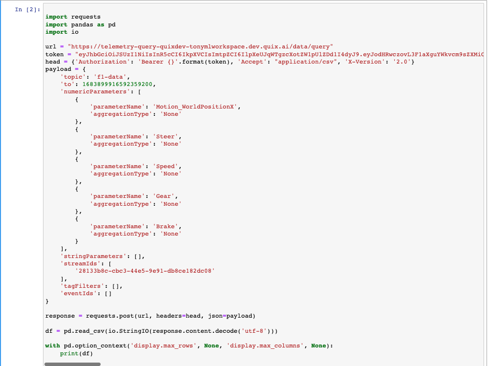

# Import data into Jupyter Notebook

From a Jupyter Notebook, you retrieve the data that was generated in Quix in the [previous part](./create-data.md), and which was persisted into the [Quix data store](../../apis/query-api/index.md). 

## Run Jupyter Notebook

Make sure you have reviewed the [prerequisites](./index.md#prerequisites), and have Jupyter Notebook already installed.

1. Now run Jupyter Notebook by entering the following command into your terminal:

``` shell
jupyter notebook
```

2. Navigate to `http://localhost:8888` with your web browser.

3. Select `New` and then `Python 3 (ipykernel)` from the menu, as shown here:

    

!!! tip

    If you don’t see **Python 3** in the `New` menu, run the following commands in your Python environment: 

    ``` python
    pip install ipykernel
    python -m ipykernel install --user
    ```

## Obtain the training data

In the [previous part](./create-data.md) you generated some real-time data in the Quix Portal. 

The Quix Portal has a code generator that can generate code to connect your Jupyter Notebook to Quix. To use the code generator to retrieve data from Quix and import it into your Notebook:

1. Make sure you are logged into the Quix Portal.

2. Select your Workspace (you probably only have one currently).

3. Click `Data Explorer` in the left-hand sidebar.

4. Click `Add Query` to add a query to visualize some data. 

5. Select the F1 Game stream in the `Add Query` wizard, and click `Next`.

6. In  the `Select parameters and events` step of the wizard, select the `Brake`, `WorldPositionX`, `Steer`, `Speed`, and `Gear` parameters. 

7. Click `Done`.

8. Turn off aggregation using the slider button, as illustrated in the following screenshot:

    

9. Use the time slider to select about ten minutes of data, as shown in the following screenshot:

    

    This is a precaution, as if your try to import too much data into Jupyter Notebook you may get a `IOPub data rate exceeded.` error. Alternatively, you can increase your capacity by setting the config variable `--NotebookApp.iopub_data_rate_limit` in Jupyter. 

10. Select the `Code` tab.

11. Select `Python` from the  the `LANGUAGE` dropdown.

    

12. Copy all the code in the `Code` tab to your clipboard. 

13. Paste the Python code from your clipboard to your Jupyter Notebook:

    

14. Click `Run`.

    The code prints out the pandas data frame containing the retrieved data, as shown in the following screenshot:

    

!!! tip

	If you want to use this generated code for more than 30 days, replace the temporary token with a [Personal Access Token](../../apis/portal-api/setup.md#personal-access-token-pat).

[Train your ML model :material-arrow-right-circle:{ align=right }](./train-ml.md)